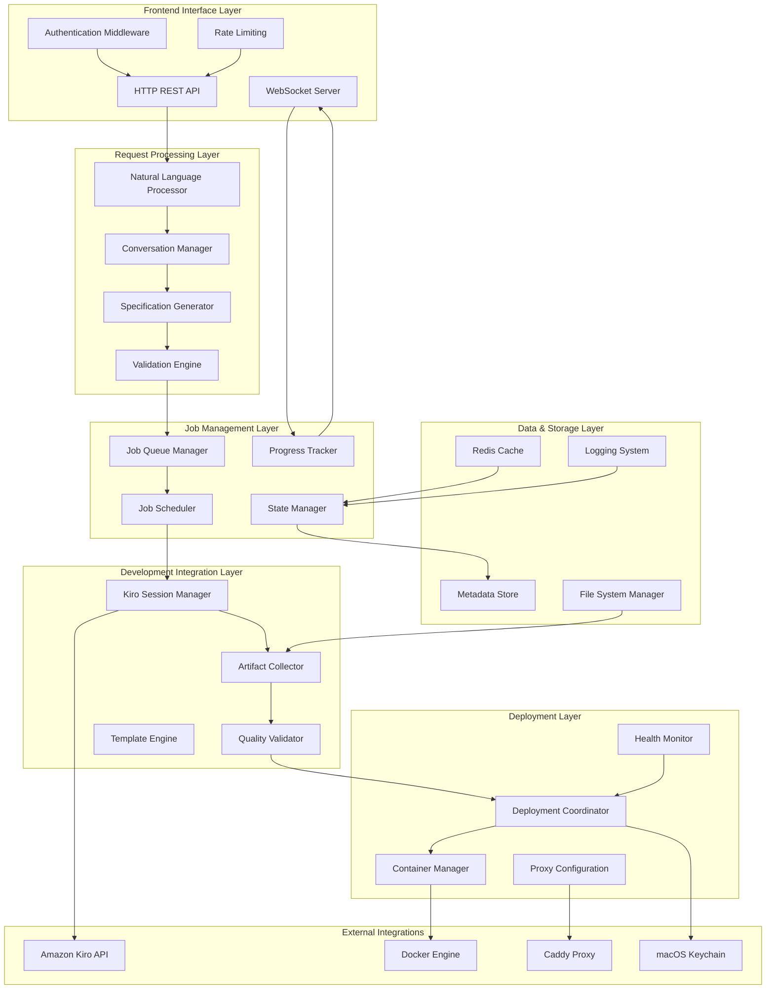

# Design Document

## Overview

The Application Orchestrator is designed as a high-performance Node.js service that acts as the intelligent coordination layer between user interfaces and AI development capabilities. The architecture emphasizes modularity, scalability, and fault tolerance while maintaining strict local operation requirements for privacy and security.

The system follows an event-driven architecture with clear separation of concerns across specification processing, job management, development coordination, and deployment automation. All components are designed for horizontal scaling and graceful degradation under load.

## Architecture



## Components and Interfaces

### Natural Language Processor

**Purpose**: Analyzes user requests and extracts structured information for application development.

**Key Components**:
- **Intent Recognition**: Identifies the type of application being requested
- **Entity Extraction**: Pulls out specific requirements, features, and constraints
- **Completeness Analysis**: Determines if sufficient information is available for development
- **Ambiguity Detection**: Identifies unclear or conflicting requirements

**Processing Pipeline**:
```typescript
interface ProcessingResult {
  intent: ApplicationIntent;
  entities: ExtractedEntity[];
  confidence: number;
  missingInformation: string[];
  clarifyingQuestions: string[];
}

class NaturalLanguageProcessor {
  async processRequest(userInput: string, context?: ConversationContext): Promise<ProcessingResult> {
    // 1. Tokenize and normalize input
    // 2. Apply intent classification models
    // 3. Extract entities and relationships
    // 4. Analyze completeness and confidence
    // 5. Generate clarifying questions if needed
  }
}
```

### Conversation Manager

**Purpose**: Manages multi-turn conversations to gather complete application requirements.

**Key Components**:
- **Context Tracking**: Maintains conversation state across multiple interactions
- **Question Generation**: Creates targeted questions to fill information gaps
- **Response Integration**: Incorporates user answers into the growing specification
- **Conversation Flow Control**: Manages the progression from initial request to complete specification

**Conversation State Model**:
```typescript
interface ConversationState {
  id: string;
  userId: string;
  currentPhase: ConversationPhase;
  gatheredInformation: Partial<ApplicationSpec>;
  pendingQuestions: Question[];
  conversationHistory: ConversationTurn[];
  confidence: number;
  lastActivity: Date;
}

enum ConversationPhase {
  INITIAL_REQUEST = 'initial_request',
  GATHERING_REQUIREMENTS = 'gathering_requirements',
  CLARIFYING_DETAILS = 'clarifying_details',
  CONFIRMING_SPECIFICATION = 'confirming_specification',
  COMPLETED = 'completed'
}
```

### Specification Generator

**Purpose**: Converts gathered requirements into structured technical specifications for Kiro development.

**Key Components**:
- **Requirement Mapping**: Translates user needs into technical requirements
- **Architecture Selection**: Chooses appropriate technical stack and patterns
- **Template Application**: Applies predefined templates for common application types
- **Constraint Validation**: Ensures specifications are feasible within system limitations

**Specification Structure**:
```typescript
interface ApplicationSpecification {
  metadata: {
    id: string;
    title: string;
    description: string;
    category: ApplicationCategory;
    estimatedComplexity: ComplexityLevel;
  };
  
  requirements: {
    functional: FunctionalRequirement[];
    nonFunctional: NonFunctionalRequirement[];
    constraints: SystemConstraint[];
  };
  
  architecture: {
    type: ApplicationType; // web, desktop, cli
    framework: string;
    database?: DatabaseConfig;
    apis?: ExternalApiConfig[];
  };
  
  development: {
    template: string;
    customizations: TemplateCustomization[];
    testingStrategy: TestingConfig;
    deploymentConfig: DeploymentConfig;
  };
  
  resources: {
    estimatedDevelopmentTime: number;
    resourceLimits: ResourceLimits;
    dependencies: Dependency[];
  };
}
```

### Job Queue Manager

**Purpose**: Manages the queue of development jobs with prioritization and resource allocation.

**Key Components**:
- **Priority Queue**: Orders jobs based on user preferences and system policies
- **Resource Allocation**: Assigns appropriate resources to each development job
- **Concurrency Control**: Manages parallel job execution within system limits
- **Job Persistence**: Ensures job state survives system restarts

**Job Management**:
```typescript
interface DevelopmentJob {
  id: string;
  userId: string;
  specification: ApplicationSpecification;
  priority: JobPriority;
  status: JobStatus;
  progress: JobProgress;
  resources: AllocatedResources;
  kiroSession?: KiroSessionInfo;
  createdAt: Date;
  startedAt?: Date;
  completedAt?: Date;
  error?: JobError;
}

class JobQueueManager {
  async enqueueJob(spec: ApplicationSpecification, priority: JobPriority): Promise<string>;
  async getNextJob(): Promise<DevelopmentJob | null>;
  async updateJobProgress(jobId: string, progress: JobProgress): Promise<void>;
  async cancelJob(jobId: string, reason: string): Promise<void>;
}
```

### Kiro Session Manager

**Purpose**: Manages Amazon Kiro development sessions with monitoring and artifact collection.

**Key Components**:
- **Session Lifecycle**: Creates, monitors, and terminates Kiro development sessions
- **Progress Monitoring**: Tracks development milestones and collects progress information
- **Artifact Collection**: Gathers generated code, tests, and documentation
- **Error Recovery**: Handles session failures and implements retry strategies

**Session Management**:
```typescript
interface KiroSessionConfig {
  workspaceTemplate: string;
  developmentInstructions: string;
  qualityGates: QualityGate[];
  timeoutMinutes: number;
  resourceLimits: KiroResourceLimits;
}

class KiroSessionManager {
  async createSession(jobId: string, config: KiroSessionConfig): Promise<KiroSession>;
  async monitorSession(sessionId: string): Promise<SessionStatus>;
  async collectArtifacts(sessionId: string): Promise<DevelopmentArtifacts>;
  async terminateSession(sessionId: string): Promise<void>;
}

interface DevelopmentArtifacts {
  sourceCode: SourceCodeArtifact[];
  tests: TestArtifact[];
  documentation: DocumentationArtifact[];
  buildArtifacts: BuildArtifact[];
  containerConfig: ContainerConfiguration;
}
```

### Deployment Coordinator

**Purpose**: Orchestrates the deployment of completed applications with health monitoring.

**Key Components**:
- **Container Orchestration**: Creates and manages Docker containers for applications
- **Proxy Configuration**: Configures reverse proxy routing for application access
- **Health Monitoring**: Implements health checks and monitoring for deployed applications
- **Rollback Management**: Provides rollback capabilities for failed deployments

**Deployment Pipeline**:
```typescript
interface DeploymentPlan {
  applicationId: string;
  containerConfig: ContainerConfiguration;
  networkConfig: NetworkConfiguration;
  securityPolicies: SecurityPolicy[];
  healthChecks: HealthCheckConfig[];
  rollbackStrategy: RollbackStrategy;
}

class DeploymentCoordinator {
  async planDeployment(artifacts: DevelopmentArtifacts): Promise<DeploymentPlan>;
  async executeDeployment(plan: DeploymentPlan): Promise<DeploymentResult>;
  async monitorDeployment(deploymentId: string): Promise<DeploymentStatus>;
  async rollbackDeployment(deploymentId: string): Promise<RollbackResult>;
}
```

## Data Models

### Application Lifecycle State

```typescript
enum ApplicationStatus {
  REQUESTED = 'requested',
  ANALYZING = 'analyzing',
  GATHERING_REQUIREMENTS = 'gathering_requirements',
  GENERATING_SPECIFICATION = 'generating_specification',
  QUEUED = 'queued',
  DEVELOPING = 'developing',
  TESTING = 'testing',
  BUILDING = 'building',
  DEPLOYING = 'deploying',
  READY = 'ready',
  RUNNING = 'running',
  FAILED = 'failed',
  UPDATING = 'updating'
}

interface ApplicationRecord {
  id: string;
  userId: string;
  title: string;
  description: string;
  status: ApplicationStatus;
  specification?: ApplicationSpecification;
  jobId?: string;
  deploymentId?: string;
  conversationId?: string;
  progress: ApplicationProgress;
  metadata: ApplicationMetadata;
  createdAt: Date;
  updatedAt: Date;
}
```

### Progress Tracking

```typescript
interface ApplicationProgress {
  percentage: number;
  currentPhase: string;
  milestones: ProgressMilestone[];
  estimatedCompletion?: Date;
  logs: ProgressLog[];
}

interface ProgressMilestone {
  name: string;
  status: MilestoneStatus;
  startedAt?: Date;
  completedAt?: Date;
  details?: string;
}

enum MilestoneStatus {
  PENDING = 'pending',
  IN_PROGRESS = 'in_progress',
  COMPLETED = 'completed',
  FAILED = 'failed',
  SKIPPED = 'skipped'
}
```

### Error Handling Model

```typescript
abstract class OrchestrationError extends Error {
  abstract readonly code: string;
  abstract readonly category: ErrorCategory;
  abstract readonly userMessage: string;
  abstract readonly recoverable: boolean;
  
  constructor(
    message: string,
    public readonly context: Record<string, any> = {},
    public readonly cause?: Error
  ) {
    super(message);
  }
}

class SpecificationError extends OrchestrationError {
  readonly code = 'SPECIFICATION_ERROR';
  readonly category = ErrorCategory.USER_INPUT;
  readonly recoverable = true;
  
  constructor(
    public readonly userMessage: string,
    public readonly field?: string,
    context: Record<string, any> = {}
  ) {
    super(`Specification validation failed: ${userMessage}`, context);
  }
}

class KiroSessionError extends OrchestrationError {
  readonly code = 'KIRO_SESSION_ERROR';
  readonly category = ErrorCategory.EXTERNAL_SERVICE;
  readonly recoverable = true;
  
  constructor(
    public readonly userMessage: string,
    public readonly sessionId: string,
    context: Record<string, any> = {}
  ) {
    super(`Kiro session failed: ${userMessage}`, { ...context, sessionId });
  }
}
```

## Error Handling

### Error Categories and Recovery Strategies

**User Input Errors**: Invalid or incomplete user requests
- Recovery: Request clarification through conversation interface
- User Experience: Clear guidance on what information is needed

**Resource Constraints**: Insufficient system resources for development or deployment
- Recovery: Queue job for later execution or suggest simplified alternatives
- User Experience: Transparent communication about delays and alternatives

**External Service Failures**: Amazon Kiro or Docker service unavailability
- Recovery: Retry with exponential backoff, fallback to alternative approaches
- User Experience: Status updates and estimated recovery times

**Development Failures**: Code generation or build failures in Kiro
- Recovery: Analyze failure patterns, adjust specifications, retry with modifications
- User Experience: Explanation of issues and suggested specification changes

### Error Propagation and Logging

```typescript
class ErrorHandler {
  async handleError(error: OrchestrationError, context: OperationContext): Promise<ErrorResponse> {
    // Log error with full context
    await this.logError(error, context);
    
    // Determine recovery strategy
    const recovery = await this.determineRecovery(error, context);
    
    // Update application status
    await this.updateApplicationStatus(context.applicationId, error);
    
    // Notify user through appropriate channel
    await this.notifyUser(context.userId, error, recovery);
    
    return {
      userMessage: error.userMessage,
      recoveryOptions: recovery.options,
      supportReference: error.context.correlationId
    };
  }
}
```

## Testing Strategy

### Unit Testing

**Component Isolation**: Each orchestrator component is tested in isolation with comprehensive mocking of dependencies.

**Business Logic Validation**: Core algorithms for specification generation, job scheduling, and deployment coordination are thoroughly tested.

**Error Path Testing**: All error conditions and recovery mechanisms are explicitly tested to ensure graceful failure handling.

### Integration Testing

**End-to-End Workflows**: Complete user journeys from request to deployed application are tested with realistic data and timing.

**External Service Integration**: Integration with Amazon Kiro, Docker, and other external services is tested with both success and failure scenarios.

**Concurrency Testing**: Multiple concurrent operations are tested to ensure proper resource management and state consistency.

### Performance Testing

**Load Testing**: System behavior under high request volumes and concurrent development jobs is validated.

**Resource Usage**: Memory, CPU, and disk usage patterns are monitored and optimized for efficient operation.

**Scalability Testing**: System performance is tested across different scales of operation to identify bottlenecks.

### Security Testing

**Input Validation**: All user inputs are tested for injection attacks and malicious content.

**Privilege Escalation**: Container and system access controls are tested to prevent unauthorized access.

**Data Privacy**: All data handling is tested to ensure no sensitive information leaves the local system.