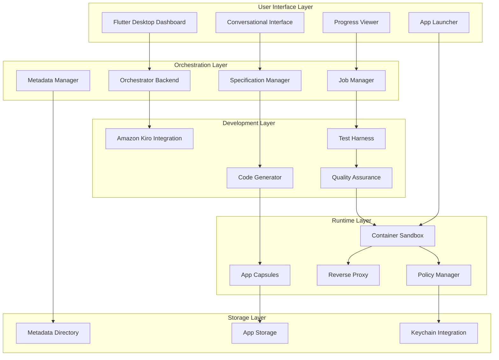

# Design Document

## Overview

The Household Software Engineer system is architected as a multi-component desktop application that enables non-technical users to create custom household applications through natural language interaction. The system maintains strict local operation for privacy while providing enterprise-grade application isolation and management capabilities.

The architecture follows a layered approach with clear separation of concerns:
- **Presentation Layer**: Flutter desktop application providing the user interface
- **Orchestration Layer**: Backend service managing application lifecycle and AI development sessions
- **Development Layer**: Amazon Kiro integration for AI-powered code generation
- **Runtime Layer**: Containerized application execution with sandboxing and proxy routing

## Architecture



## Components and Interfaces

### Flutter Desktop Dashboard

**Purpose**: Primary user interface providing application management and creation capabilities.

**Key Components**:
- **Application Grid**: Displays existing applications as interactive tiles with status indicators
- **Conversational Interface**: Natural language input system for application requests and modifications
- **Progress Monitor**: Real-time development status display with milestone tracking
- **Application Launcher**: WebView and native window management for running applications

**Interfaces**:
- REST API communication with Orchestrator Backend
- WebSocket connection for real-time progress updates
- Native macOS integration for window management and system notifications

### Orchestrator Backend

**Purpose**: Central coordination service managing all application lifecycle operations.

**Key Components**:
- **Specification Manager**: Converts user input into structured development specifications
- **Job Manager**: Coordinates Amazon Kiro development sessions and tracks progress
- **Metadata Manager**: Maintains application registry and configuration data
- **Deployment Manager**: Handles container creation, proxy registration, and application startup

**Interfaces**:
- HTTP REST API for Flutter frontend communication
- WebSocket server for real-time progress broadcasting
- Amazon Kiro API integration for development session management
- Container runtime API for application deployment
- File system operations for metadata and App Capsule management

### Amazon Kiro Integration

**Purpose**: AI-powered development engine that generates, tests, and refines application code.

**Key Components**:
- **Specification Parser**: Interprets structured requirements into development tasks
- **Code Generator**: Creates application source code following predefined templates and policies
- **Test Generator**: Produces comprehensive test suites for generated applications
- **Quality Validator**: Ensures code meets standards through iterative refinement

**Interfaces**:
- Headless development session API
- Template and policy configuration system
- Build and test execution environment
- Artifact output to App Capsules

### Application Runtime Environment

**Purpose**: Secure, isolated execution environment for generated applications.

**Key Components**:
- **Container Sandbox**: Docker-based isolation with resource and access controls
- **Policy Engine**: Enforces network, filesystem, and system access restrictions
- **Reverse Proxy**: Routes application traffic through Caddy with SSL termination
- **Storage Manager**: Provides isolated data storage for each application

**Interfaces**:
- Container orchestration API
- Network policy configuration
- Filesystem mount management
- macOS Keychain integration for secrets

## Data Models

### Application Metadata

```json
{
  "id": "uuid",
  "title": "string",
  "description": "string",
  "status": "enum[requested, developing, testing, deployed, failed]",
  "created_at": "timestamp",
  "updated_at": "timestamp",
  "specification": {
    "user_request": "string",
    "requirements": "array[requirement]",
    "technical_spec": "object"
  },
  "deployment": {
    "type": "enum[web, desktop]",
    "port": "number",
    "container_id": "string",
    "health_check_url": "string"
  },
  "development": {
    "kiro_session_id": "string",
    "progress": "number",
    "current_phase": "string",
    "build_logs": "array[log_entry]"
  }
}
```

### App Capsule Structure

```
app-capsules/
├── {app-id}/
│   ├── manifest.json          # Application metadata and configuration
│   ├── src/                   # Generated source code
│   ├── tests/                 # Test suites
│   ├── docs/                  # Generated documentation
│   ├── container/
│   │   ├── Dockerfile         # Container configuration
│   │   └── docker-compose.yml # Service definition
│   ├── data/                  # Application-specific data storage
│   └── policies/
│       ├── network.json       # Network access rules
│       └── filesystem.json    # File access permissions
```

### Development Job

```json
{
  "job_id": "uuid",
  "app_id": "uuid",
  "type": "enum[create, modify]",
  "status": "enum[queued, running, completed, failed]",
  "kiro_session": {
    "session_id": "string",
    "workspace_path": "string",
    "progress_milestones": "array[milestone]"
  },
  "artifacts": {
    "source_files": "array[file_path]",
    "test_results": "object",
    "build_output": "string"
  }
}
```

## Error Handling

### User-Facing Error Management

**Graceful Degradation**: When development sessions fail, the system provides clear, non-technical error messages and suggests alternative approaches or simplifications.

**Recovery Mechanisms**: Failed applications can be retried with modified specifications, and partial progress is preserved to avoid starting from scratch.

**Validation Gates**: User input is validated at multiple stages to catch issues early before expensive development operations begin.

### System-Level Error Handling

**Container Failures**: Applications that crash or become unresponsive are automatically restarted with exponential backoff, and persistent failures trigger user notifications.

**Development Session Failures**: Amazon Kiro session interruptions are detected and automatically resumed where possible, with fallback to manual intervention prompts.

**Resource Management**: System monitors disk space, memory usage, and container limits to prevent resource exhaustion and provide early warnings.

### Logging and Monitoring

**Structured Logging**: All components use structured JSON logging with correlation IDs for tracing requests across system boundaries.

**Health Checks**: Each component exposes health endpoints for monitoring system status and detecting degraded performance.

**Audit Trail**: All user actions and system operations are logged for troubleshooting and system analysis.

## Testing Strategy

### Unit Testing

**Component Isolation**: Each system component has comprehensive unit tests with mocked dependencies to ensure reliable behavior in isolation.

**Business Logic Validation**: Core algorithms for specification parsing, job management, and application deployment are thoroughly tested with edge cases.

**Error Path Testing**: All error handling paths are explicitly tested to ensure graceful failure modes.

### Integration Testing

**API Contract Testing**: All interfaces between components are validated with contract tests to ensure compatibility during development.

**End-to-End Workflows**: Complete user journeys from application request to deployment are tested in automated scenarios.

**Container Integration**: Application deployment and runtime behavior is tested in realistic container environments.

### User Acceptance Testing

**Usability Validation**: The conversational interface and dashboard are tested with representative household users to ensure intuitive operation.

**Performance Testing**: System responsiveness and resource usage are validated under typical household workloads.

**Security Testing**: Application isolation, network restrictions, and data privacy controls are verified through penetration testing.

### Generated Application Testing

**Template Validation**: All application templates include comprehensive test suites that validate generated code functionality.

**Quality Gates**: Generated applications must pass all tests before deployment, with iterative refinement until quality standards are met.

**Runtime Validation**: Deployed applications are continuously monitored for health and performance to ensure ongoing reliability.