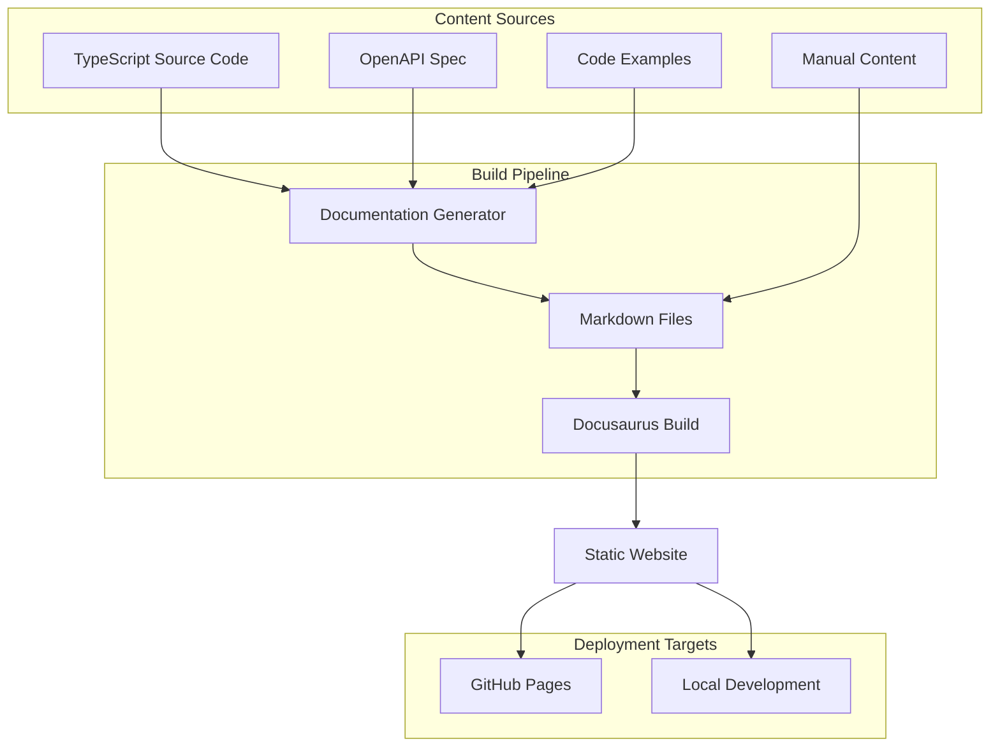

# Design Document

## Overview

The Kiro Communication Bridge Documentation Website will be built using Docusaurus v3, a modern static site generator optimized for documentation. The site will provide comprehensive, interactive documentation for the REST API exposed by the kiro-communication-bridge VS Code extension. The design emphasizes developer experience, accuracy, and maintainability through automated content generation from the TypeScript source code.

## Architecture

### High-Level Architecture



### Site Structure

The documentation website will follow a logical hierarchy optimized for different user personas:

```
docs/
├── intro.md                          # Getting Started
├── overview/
│   ├── architecture.md               # System Architecture
│   ├── data-flow.md                  # Data Flow Diagrams
│   └── integration-patterns.md       # Integration Patterns
├── api/
│   ├── overview.md                   # API Overview
│   ├── authentication.md             # Authentication & Security
│   ├── endpoints/
│   │   ├── execute-command.md        # POST /api/kiro/execute
│   │   ├── get-status.md             # GET /api/kiro/status
│   │   ├── user-input.md             # POST /api/kiro/input
│   │   └── health-check.md           # GET /health
│   ├── types/
│   │   ├── command-execution.md      # Command execution types
│   │   ├── application-metadata.md   # Application metadata types
│   │   ├── development-job.md        # Development job types
│   │   └── error-types.md            # Error handling types
│   └── examples/
│       ├── flutter-integration.md    # Flutter/Dart examples
│       ├── typescript-client.md      # TypeScript examples
│       └── curl-examples.md          # cURL examples
├── guides/
│   ├── quick-start.md                # Quick Start Tutorial
│   ├── flutter-setup.md              # Flutter Integration Guide
│   ├── error-handling.md             # Error Handling Best Practices
│   ├── polling-strategies.md         # Real-time Updates via Polling
│   └── troubleshooting.md            # Common Issues & Solutions
└── reference/
    ├── configuration.md              # Configuration Options
    ├── deployment.md                 # Deployment Guide
    └── changelog.md                  # Version History
```

## Components and Interfaces

### Documentation Generator

The documentation generator will be a Node.js script that extracts information from the TypeScript source code and generates Markdown files.

```typescript
interface DocumentationGenerator {
  // Extract API endpoints from source code
  extractEndpoints(sourceFiles: string[]): ApiEndpoint[];
  
  // Extract type definitions
  extractTypes(sourceFiles: string[]): TypeDefinition[];
  
  // Generate OpenAPI specification
  generateOpenApiSpec(): OpenApiSpec;
  
  // Generate Markdown documentation
  generateMarkdown(endpoints: ApiEndpoint[], types: TypeDefinition[]): MarkdownFile[];
  
  // Validate examples against actual API
  validateExamples(examples: CodeExample[]): ValidationResult[];
}

interface ApiEndpoint {
  path: string;
  method: HttpMethod;
  description: string;
  parameters: Parameter[];
  requestBody?: RequestBodySchema;
  responses: ResponseSchema[];
  examples: Example[];
  errorCodes: ErrorCode[];
}

interface TypeDefinition {
  name: string;
  description: string;
  properties: Property[];
  examples: any[];
  sourceLocation: string;
}
```

### Docusaurus Configuration

The site will use a custom Docusaurus configuration optimized for API documentation:

```javascript
// docusaurus.config.js
module.exports = {
  title: 'Kiro Communication Bridge API',
  tagline: 'REST API Documentation for Flutter Integration',
  url: 'https://your-org.github.io',
  baseUrl: '/kiro-bridge-docs/',
  
  themeConfig: {
    navbar: {
      title: 'Kiro Bridge API',
      items: [
        { to: '/docs/intro', label: 'Docs', position: 'left' },
        { to: '/docs/api/overview', label: 'API Reference', position: 'left' },
        { to: '/docs/guides/quick-start', label: 'Guides', position: 'left' },
        { href: 'https://github.com/your-org/kiro-bridge', label: 'GitHub', position: 'right' }
      ]
    },
    
    footer: {
      style: 'dark',
      links: [
        {
          title: 'Documentation',
          items: [
            { label: 'Getting Started', to: '/docs/intro' },
            { label: 'API Reference', to: '/docs/api/overview' },
            { label: 'Guides', to: '/docs/guides/quick-start' }
          ]
        },
        {
          title: 'Community',
          items: [
            { label: 'GitHub Issues', href: 'https://github.com/your-org/kiro-bridge/issues' },
            { label: 'Discussions', href: 'https://github.com/your-org/kiro-bridge/discussions' }
          ]
        }
      ]
    },
    
    prism: {
      theme: lightCodeTheme,
      darkTheme: darkCodeTheme,
      additionalLanguages: ['dart', 'bash', 'json']
    },
    
    algolia: {
      appId: 'YOUR_APP_ID',
      apiKey: 'YOUR_SEARCH_API_KEY',
      indexName: 'kiro-bridge-docs'
    }
  },
  
  plugins: [
    '@docusaurus/plugin-content-docs',
    '@docusaurus/plugin-content-pages',
    '@docusaurus/plugin-sitemap',
    'docusaurus-plugin-openapi-docs'
  ]
};
```

### Interactive API Explorer

The site will include an interactive API explorer using the OpenAPI specification:

```typescript
interface ApiExplorer {
  // Render interactive endpoint documentation
  renderEndpoint(endpoint: ApiEndpoint): React.Component;
  
  // Provide try-it-out functionality
  executeLiveRequest(request: ApiRequest): Promise<ApiResponse>;
  
  // Generate code samples in multiple languages
  generateCodeSample(endpoint: ApiEndpoint, language: 'typescript' | 'dart' | 'curl'): string;
  
  // Validate request parameters
  validateRequest(request: ApiRequest, schema: JsonSchema): ValidationResult;
}
```

## Data Models

### API Documentation Schema

```typescript
interface ApiDocumentation {
  info: {
    title: string;
    version: string;
    description: string;
    contact: ContactInfo;
  };
  
  servers: ServerInfo[];
  endpoints: ApiEndpoint[];
  types: TypeDefinition[];
  examples: CodeExample[];
  guides: Guide[];
}

interface ServerInfo {
  url: string;
  description: string;
  environment: 'development' | 'production';
}

interface CodeExample {
  title: string;
  description: string;
  language: 'typescript' | 'dart' | 'bash' | 'json';
  code: string;
  endpoint?: string;
  validated: boolean;
}

interface Guide {
  id: string;
  title: string;
  description: string;
  category: 'getting-started' | 'integration' | 'advanced';
  content: string;
  codeExamples: CodeExample[];
}
```

### Content Generation Pipeline

```typescript
interface ContentPipeline {
  // Source code analysis
  analyzeSourceCode(paths: string[]): SourceAnalysis;
  
  // Content generation
  generateApiDocs(analysis: SourceAnalysis): ApiDocumentation;
  generateGuides(templates: GuideTemplate[]): Guide[];
  generateExamples(endpoints: ApiEndpoint[]): CodeExample[];
  
  // Content validation
  validateContent(content: ApiDocumentation): ValidationResult[];
  validateExamples(examples: CodeExample[]): ValidationResult[];
  
  // Output generation
  generateMarkdownFiles(content: ApiDocumentation): MarkdownFile[];
  generateOpenApiSpec(content: ApiDocumentation): OpenApiSpec;
}
```

## Error Handling

### Documentation Build Errors

The system will handle various error scenarios during documentation generation:

```typescript
enum DocumentationError {
  SOURCE_PARSE_ERROR = 'Failed to parse TypeScript source files',
  TYPE_EXTRACTION_ERROR = 'Failed to extract type definitions',
  EXAMPLE_VALIDATION_ERROR = 'Code examples failed validation',
  MARKDOWN_GENERATION_ERROR = 'Failed to generate Markdown files',
  BUILD_ERROR = 'Docusaurus build failed'
}

interface ErrorHandler {
  handleSourceParseError(error: ParseError): void;
  handleTypeExtractionError(error: ExtractionError): void;
  handleExampleValidationError(error: ValidationError): void;
  handleBuildError(error: BuildError): void;
  
  // Provide fallback content for missing information
  generateFallbackContent(missingContent: string[]): Content;
}
```

### Runtime Error Display

The documentation site will gracefully handle missing or invalid content:

```typescript
interface ErrorDisplay {
  // Show user-friendly error messages
  displayContentError(error: ContentError): React.Component;
  
  // Provide fallback content
  renderFallbackContent(contentType: string): React.Component;
  
  // Show validation warnings
  displayValidationWarnings(warnings: ValidationWarning[]): React.Component;
}
```

## Testing Strategy

### Automated Testing

```typescript
interface DocumentationTesting {
  // Test content generation
  testContentGeneration(): TestResult[];
  
  // Test example validation
  testExampleValidation(): TestResult[];
  
  // Test site build
  testSiteBuild(): TestResult[];
  
  // Test link validation
  testLinkValidation(): TestResult[];
  
  // Test accessibility
  testAccessibility(): AccessibilityResult[];
}
```

### Content Validation

1. **API Accuracy Testing**: Validate that documented endpoints match actual implementation
2. **Example Testing**: Ensure all code examples execute successfully
3. **Link Testing**: Verify all internal and external links are valid
4. **Schema Validation**: Ensure type definitions match TypeScript interfaces
5. **Accessibility Testing**: Verify WCAG compliance

### Performance Testing

1. **Build Performance**: Measure documentation generation and build times
2. **Site Performance**: Test page load times and bundle sizes
3. **Search Performance**: Validate search functionality and response times

## Implementation Phases

### Phase 1: Foundation Setup
- Set up Docusaurus project structure
- Create basic site configuration
- Implement TypeScript source code analysis
- Generate initial API endpoint documentation

### Phase 2: Content Generation
- Implement automated type definition extraction
- Create code example generation system
- Build content validation pipeline
- Generate comprehensive API reference

### Phase 3: Interactive Features
- Implement API explorer with try-it-out functionality
- Add interactive code samples
- Create search functionality
- Implement responsive design

### Phase 4: Advanced Features
- Add automated content updates from CI/CD
- Implement analytics and usage tracking
- Create advanced filtering and navigation
- Add multi-language support for examples

### Phase 5: Polish and Optimization
- Optimize site performance
- Enhance accessibility
- Add comprehensive testing
- Create deployment automation

## Deployment Strategy

### Build Pipeline

```yaml
# GitHub Actions workflow
name: Documentation Build and Deploy

on:
  push:
    branches: [main]
    paths: ['kiro-communication-bridge/src/**', 'docs/**']

jobs:
  build-and-deploy:
    runs-on: ubuntu-latest
    steps:
      - uses: actions/checkout@v3
      - uses: actions/setup-node@v3
        with:
          node-version: '18'
      
      - name: Install dependencies
        run: npm ci
      
      - name: Generate documentation
        run: npm run generate-docs
      
      - name: Build site
        run: npm run build
      
      - name: Deploy to GitHub Pages
        uses: peaceiris/actions-gh-pages@v3
        with:
          github_token: ${{ secrets.GITHUB_TOKEN }}
          publish_dir: ./build
```

### Hosting Options

1. **GitHub Pages**: Primary hosting for public documentation
2. **Netlify**: Alternative with preview deployments for pull requests
3. **Local Development**: Docker container for offline development

### Content Delivery

1. **CDN Integration**: Use GitHub Pages CDN for global distribution
2. **Asset Optimization**: Compress images and optimize bundle sizes
3. **Caching Strategy**: Implement appropriate cache headers for static assets

This design provides a comprehensive, maintainable, and user-friendly documentation website that will serve as the definitive reference for the Kiro Communication Bridge API.