# Design Document

## Overview

The Kiro Command Research Tool is a simplified VS Code extension that discovers and documents Kiro IDE commands for remote orchestration. It focuses on command discovery, basic analysis, and JSON-based documentation generation for integration with the Dwellware orchestration layer.

## Architecture

### Core Components

```mermaid
graph TB
    A[Command Discovery Engine] --> B[Command Registry Scanner]
    A --> C[Signature Introspector]
    
    D[Testing Framework] --> E[Parameter Validator]
    D --> F[Execution Engine]
    D --> G[Result Capture]
    
    H[Documentation Generator] --> I[Schema Generator]
    H --> J[API Doc Builder]
    H --> K[Export Manager]
    
    L[Workflow Analyzer] --> M[Dependency Tracker]
    L --> N[Sequence Validator]
    L --> O[Template Generator]
    
    P[Monitoring System] --> Q[Metrics Collector]
    P --> R[Performance Analyzer]
    P --> S[Usage Pattern Detector]
    
    T[UI Components] --> U[Command Explorer]
    T --> V[Testing Interface]
    T --> W[Documentation Viewer]
```



### Data Models

#### Simplified Command Metadata
```typescript
interface CommandMetadata {
  id: string;
  category: 'kiroAgent' | 'kiro';
  subcategory: string;
  displayName: string;
  description?: string;
  riskLevel: 'safe' | 'moderate' | 'destructive';
  contextRequirements: string[];
  discoveredAt: Date;
}

interface DiscoveryResults {
  totalCommands: number;
  kiroAgentCommands: number;
  kiroCommands: number;
  commands: CommandMetadata[];
  discoveryTimestamp: Date;
  statistics: {
    safeCommands: number;
    moderateCommands: number;
    destructiveCommands: number;
    subcategories: string[];
  };
}
```

## Components and Interfaces

### Command Discovery Engine

**Purpose**: Automatically discover and catalog all Kiro commands available in the VS Code environment.

**Key Methods**:
- `scanCommandRegistry()`: Discovers all registered commands
- `categorizeCommand(commandId: string)`: Assigns functional categories
- `assessRiskLevel(commandId: string)`: Determines command safety level
- `saveResults(results: DiscoveryResults)`: Saves results to JSON file

**Implementation Strategy**:
- Use VS Code's `vscode.commands.getCommands()` to list all commands
- Filter for commands starting with 'kiro' or 'kiroAgent'
- Categorize commands by analyzing their structure and naming patterns
- Store results in simple JSON files for easy access and sharing

### Documentation Generator

**Purpose**: Generate simple documentation formats for integration use.

**Output Formats**:
- **JSON Export**: Complete command metadata for programmatic access
- **Markdown Documentation**: Human-readable reference with categorization
- **TypeScript Definitions**: Basic type definitions for development

**Key Methods**:
- `exportToJSON(commands: CommandMetadata[])`: Creates JSON export
- `generateMarkdownDocs(commands: CommandMetadata[])`: Creates documentation
- `generateTypeDefinitions(commands: CommandMetadata[])`: Creates basic TypeScript types

## Data Models

### File-Based Storage
Commands and their metadata will be stored in simple JSON files in the extension's workspace:

```
.kiro/command-research/
├── discovery-results.json     # Latest discovery results
├── commands/                  # Individual command files (optional)
├── exports/                   # Generated documentation
│   ├── commands.json         # Full JSON export
│   ├── commands.md           # Markdown documentation
│   └── commands.d.ts         # TypeScript definitions
└── logs/                     # Discovery logs
    └── discovery-YYYY-MM-DD.log
```

## Error Handling

### Command Discovery Errors
- **Missing Commands**: Log warnings for expected commands that aren't found
- **Introspection Failures**: Fall back to manual documentation mode
- **Permission Errors**: Handle commands that require elevated permissions

### Testing Errors
- **Parameter Validation**: Provide clear error messages for invalid parameters
- **Execution Failures**: Capture and categorize different types of command failures
- **Timeout Handling**: Gracefully handle commands that don't complete within expected time
- **State Corruption**: Detect and report when commands leave workspace in inconsistent state

### Documentation Errors
- **Export Failures**: Handle file system errors during documentation export
- **Schema Validation**: Ensure generated schemas are valid and complete
- **Template Generation**: Handle edge cases in workflow template creation

## Testing Strategy

### Unit Testing
- Test command discovery logic with mock VS Code API
- Validate parameter validation logic with various input types
- Test documentation generation with sample command metadata
- Verify workflow analysis with known command sequences

### Integration Testing
- Test actual command execution in controlled VS Code environment
- Validate generated documentation against real Kiro commands
- Test workflow templates with actual development scenarios
- Verify database operations and data persistence

### Safety Testing
- Test destructive command handling with disposable workspaces
- Validate rollback mechanisms for failed operations
- Test timeout and cancellation functionality
- Verify permission handling for restricted commands

## Performance Considerations

### Command Discovery
- Cache command metadata to avoid repeated introspection
- Use incremental updates when VS Code command registry changes
- Implement lazy loading for command details

### Testing Framework
- Implement command execution queuing to avoid conflicts
- Use workspace snapshots efficiently to minimize overhead
- Provide progress indicators for long-running operations

### Documentation Generation
- Generate documentation incrementally as commands are tested
- Cache generated schemas and templates
- Support partial exports for large command sets

## Security Considerations

### Command Execution Safety
- Implement command risk assessment and categorization
- Require explicit confirmation for destructive operations
- Maintain audit log of all command executions
- Provide workspace backup and restore capabilities

### Data Protection
- Encrypt sensitive command parameters in storage
- Sanitize command results before logging
- Implement secure export of documentation
- Protect against command injection attacks in WebSocket bridge