# Design Document

## Overview

The Kiro Command Research Tool is a VS Code extension that systematically investigates Kiro IDE commands to enable remote orchestration. It provides command introspection, safe testing capabilities, workflow analysis, and comprehensive documentation generation for integration with the Household AI Engineer orchestration layer.

## Architecture

### Core Components

```mermaid
graph TB
    A[Command Discovery Engine] --> B[Command Registry Scanner]
    A --> C[Signature Introspector]
    
    D[Testing Framework] --> E[Parameter Validator]
    D --> F[Execution Engine]
    D --> G[Result Capture]
    
    H[Documentation Generator] --> I[Schema Generator]
    H --> J[API Doc Builder]
    H --> K[Export Manager]
    
    L[Workflow Analyzer] --> M[Dependency Tracker]
    L --> N[Sequence Validator]
    L --> O[Template Generator]
    
    P[Monitoring System] --> Q[Metrics Collector]
    P --> R[Performance Analyzer]
    P --> S[Usage Pattern Detector]
    
    T[UI Components] --> U[Command Explorer]
    T --> V[Testing Interface]
    T --> W[Documentation Viewer]
```



### Data Models

#### Command Metadata
```typescript
interface CommandMetadata {
  id: string;
  category: 'kiroAgent' | 'kiro';
  subcategory: string;
  displayName: string;
  description?: string;
  signature: CommandSignature;
  examples: CommandExample[];
  dependencies: string[];
  riskLevel: 'safe' | 'moderate' | 'destructive';
  lastTested: Date;
  testResults: TestResult[];
}

interface CommandSignature {
  parameters: Parameter[];
  returnType: TypeDefinition;
  async: boolean;
  contextRequirements: string[];
}

interface Parameter {
  name: string;
  type: TypeDefinition;
  required: boolean;
  description?: string;
  defaultValue?: any;
  validation?: ValidationRule[];
}
```

#### Test Results
```typescript
interface TestResult {
  timestamp: Date;
  parameters: Record<string, any>;
  success: boolean;
  result?: any;
  error?: ErrorInfo;
  executionTime: number;
  sideEffects: SideEffect[];
}

interface SideEffect {
  type: 'file_created' | 'file_modified' | 'view_opened' | 'state_changed';
  description: string;
  details: Record<string, any>;
}
```

## Components and Interfaces

### Command Discovery Engine

**Purpose**: Automatically discover and catalog all Kiro commands available in the VS Code environment.

**Key Methods**:
- `scanCommandRegistry()`: Discovers all registered commands
- `introspectCommand(commandId: string)`: Attempts to determine command signature
- `categorizeCommand(commandId: string)`: Assigns functional categories
- `updateCommandMetadata(commandId: string)`: Refreshes command information

**Implementation Strategy**:
- Use VS Code's `vscode.commands.getCommands()` to list all commands
- Filter for commands starting with 'kiro' or 'kiroAgent'
- Attempt signature discovery through TypeScript definition files
- Fall back to manual documentation for undiscoverable signatures

### Testing Framework

**Purpose**: Provide safe, controlled testing of Kiro commands with parameter validation and result capture.

**Key Methods**:
- `validateParameters(commandId: string, params: any[])`: Validates input parameters
- `executeCommand(commandId: string, params: any[])`: Safely executes command
- `captureResults(execution: CommandExecution)`: Records execution results
- `detectSideEffects(beforeState: WorkspaceState, afterState: WorkspaceState)`: Identifies changes

**Safety Features**:
- Pre-execution validation of parameter types and values
- Workspace state snapshots before destructive operations
- Confirmation dialogs for high-risk commands
- Execution timeout and cancellation support
- Automatic rollback for failed operations where possible

### Documentation Generator

**Purpose**: Generate comprehensive API documentation in multiple formats for integration use.

**Output Formats**:
- **JSON Schema**: Machine-readable command definitions
- **TypeScript Definitions**: Type-safe interfaces for development
- **Markdown Documentation**: Human-readable reference
- **OpenAPI Specification**: REST-like API documentation for WebSocket bridge

**Key Methods**:
- `generateSchema(commands: CommandMetadata[])`: Creates JSON schema
- `generateTypeDefinitions(commands: CommandMetadata[])`: Creates TypeScript types
- `generateMarkdownDocs(commands: CommandMetadata[])`: Creates documentation
- `exportDocumentation(format: ExportFormat, destination: string)`: Exports docs

### Workflow Analyzer

**Purpose**: Analyze command dependencies and generate workflow templates for common development tasks.

**Analysis Capabilities**:
- **Dependency Detection**: Identify commands that must run in sequence
- **State Requirements**: Document workspace state needed for command execution
- **Common Patterns**: Identify frequently used command combinations
- **Template Generation**: Create reusable workflow templates

**Key Methods**:
- `analyzeDependencies(commandId: string)`: Maps command prerequisites
- `detectWorkflows(executionHistory: TestResult[])`: Identifies patterns
- `generateTemplate(workflow: CommandSequence)`: Creates workflow template
- `validateWorkflow(template: WorkflowTemplate)`: Tests workflow validity

## Data Models

### Command Storage
Commands and their metadata will be stored in a local SQLite database with the following schema:

```sql
-- Commands table
CREATE TABLE commands (
    id TEXT PRIMARY KEY,
    category TEXT NOT NULL,
    subcategory TEXT,
    display_name TEXT,
    description TEXT,
    signature JSON,
    risk_level TEXT DEFAULT 'safe',
    created_at DATETIME DEFAULT CURRENT_TIMESTAMP,
    updated_at DATETIME DEFAULT CURRENT_TIMESTAMP
);

-- Test results table
CREATE TABLE test_results (
    id INTEGER PRIMARY KEY AUTOINCREMENT,
    command_id TEXT REFERENCES commands(id),
    parameters JSON,
    success BOOLEAN,
    result JSON,
    error JSON,
    execution_time INTEGER,
    side_effects JSON,
    timestamp DATETIME DEFAULT CURRENT_TIMESTAMP
);

-- Command dependencies table
CREATE TABLE command_dependencies (
    command_id TEXT REFERENCES commands(id),
    depends_on TEXT REFERENCES commands(id),
    dependency_type TEXT, -- 'prerequisite', 'sequence', 'context'
    PRIMARY KEY (command_id, depends_on)
);
```

## Error Handling

### Command Discovery Errors
- **Missing Commands**: Log warnings for expected commands that aren't found
- **Introspection Failures**: Fall back to manual documentation mode
- **Permission Errors**: Handle commands that require elevated permissions

### Testing Errors
- **Parameter Validation**: Provide clear error messages for invalid parameters
- **Execution Failures**: Capture and categorize different types of command failures
- **Timeout Handling**: Gracefully handle commands that don't complete within expected time
- **State Corruption**: Detect and report when commands leave workspace in inconsistent state

### Documentation Errors
- **Export Failures**: Handle file system errors during documentation export
- **Schema Validation**: Ensure generated schemas are valid and complete
- **Template Generation**: Handle edge cases in workflow template creation

## Testing Strategy

### Unit Testing
- Test command discovery logic with mock VS Code API
- Validate parameter validation logic with various input types
- Test documentation generation with sample command metadata
- Verify workflow analysis with known command sequences

### Integration Testing
- Test actual command execution in controlled VS Code environment
- Validate generated documentation against real Kiro commands
- Test workflow templates with actual development scenarios
- Verify database operations and data persistence

### Safety Testing
- Test destructive command handling with disposable workspaces
- Validate rollback mechanisms for failed operations
- Test timeout and cancellation functionality
- Verify permission handling for restricted commands

## Performance Considerations

### Command Discovery
- Cache command metadata to avoid repeated introspection
- Use incremental updates when VS Code command registry changes
- Implement lazy loading for command details

### Testing Framework
- Implement command execution queuing to avoid conflicts
- Use workspace snapshots efficiently to minimize overhead
- Provide progress indicators for long-running operations

### Documentation Generation
- Generate documentation incrementally as commands are tested
- Cache generated schemas and templates
- Support partial exports for large command sets

## Security Considerations

### Command Execution Safety
- Implement command risk assessment and categorization
- Require explicit confirmation for destructive operations
- Maintain audit log of all command executions
- Provide workspace backup and restore capabilities

### Data Protection
- Encrypt sensitive command parameters in storage
- Sanitize command results before logging
- Implement secure export of documentation
- Protect against command injection attacks in WebSocket bridge