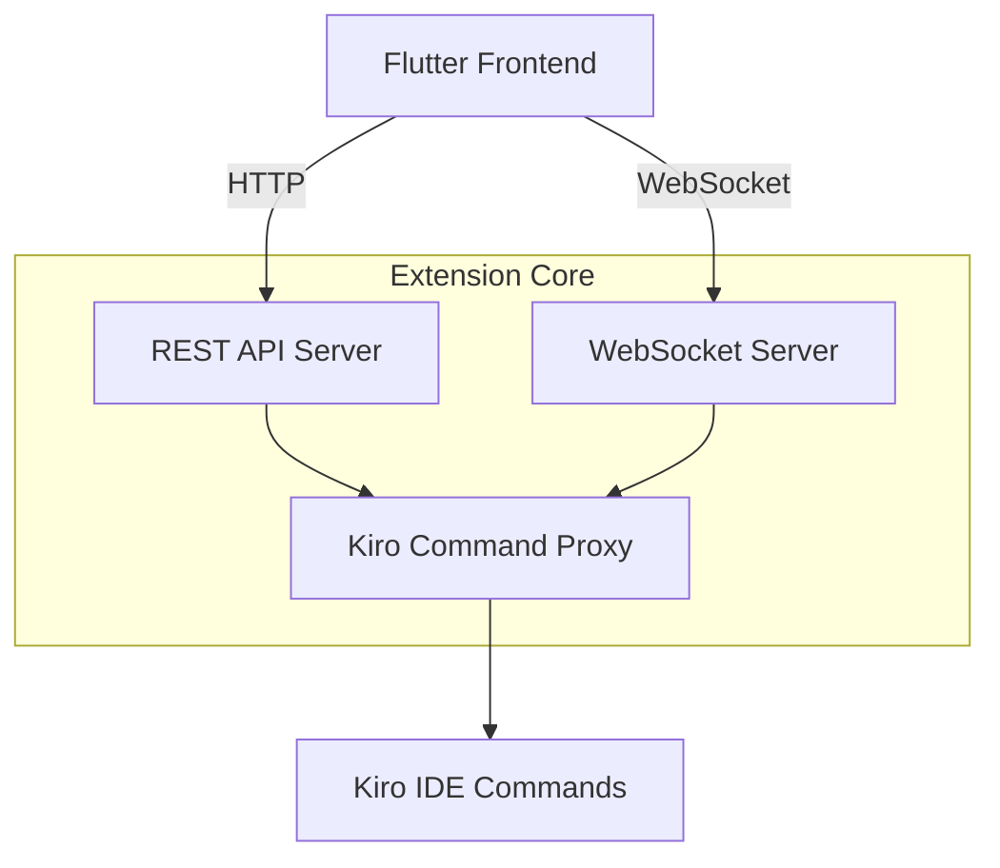
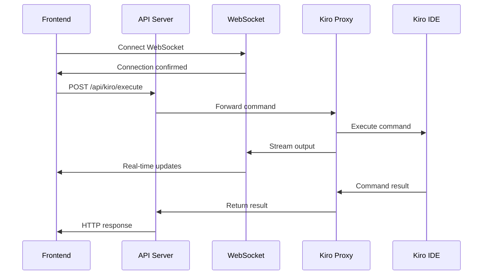

# Design Document

## Overview

The Kiro Communication Bridge is a minimal VS Code extension that provides a simple REST API and WebSocket interface for communicating with Kiro IDE. The extension acts as a lightweight proxy, forwarding commands from the Flutter frontend to Kiro and streaming responses back in real-time.

The design prioritizes simplicity and reliability over complex orchestration features. The extension focuses on three core functions: command execution, status monitoring, and real-time communication.

## Architecture

### High-Level Architecture



### Component Interaction Flow



## Components and Interfaces

### 1. REST API Server

**Purpose:** Provides HTTP endpoints for command execution and status queries.

**Key Classes:**
- `ApiServer` - Express.js server with minimal middleware
- `KiroController` - Handles command execution and status requests

**API Endpoints:**
```typescript
interface ApiEndpoints {
  // Command execution
  'POST /api/kiro/execute': (request: ExecuteCommandRequest) => ExecuteCommandResponse;
  
  // Status queries
  'GET /api/kiro/status': () => KiroStatusResponse;
  
  // User input for interactive commands
  'POST /api/kiro/input': (request: UserInputRequest) => UserInputResponse;
}

interface ExecuteCommandRequest {
  /** Kiro command to execute */
  command: string;
  
  /** Optional command arguments */
  args?: string[];
  
  /** Optional workspace context */
  workspacePath?: string;
}

interface ExecuteCommandResponse {
  /** Whether command executed successfully */
  success: boolean;
  
  /** Command output */
  output: string;
  
  /** Error message if failed */
  error?: string;
  
  /** Execution time in milliseconds */
  executionTimeMs: number;
}

interface KiroStatusResponse {
  /** Current Kiro status */
  status: 'ready' | 'busy' | 'unavailable';
  
  /** Currently executing command if busy */
  currentCommand?: string;
  
  /** Kiro version information */
  version?: string;
  
  /** Available commands */
  availableCommands: string[];
}
```

### 2. WebSocket Server

**Purpose:** Provides real-time streaming of command output and status updates.

**Key Classes:**
- `WebSocketServer` - Manages WebSocket connections
- `EventBroadcaster` - Broadcasts events to connected clients

**WebSocket Events:**
```typescript
interface WebSocketEvents {
  // Command lifecycle events
  'command-started': { command: string; timestamp: string };
  'command-output': { output: string; timestamp: string };
  'command-completed': { success: boolean; output: string; timestamp: string };
  'command-error': { error: string; timestamp: string };
  
  // User interaction events
  'user-input-required': { prompt: string; inputType: string };
  'input-accepted': { timestamp: string };
  
  // Status events
  'status-changed': { status: 'ready' | 'busy' | 'unavailable' };
  'connection-ready': { timestamp: string };
}
```

### 3. Kiro Command Proxy

**Purpose:** Interfaces directly with Kiro IDE's command system and manages command execution.

**Key Classes:**
- `KiroCommandProxy` - Executes Kiro commands and captures output
- `CommandOutputParser` - Parses command output for structured data
- `StatusMonitor` - Monitors Kiro's availability and current state

**Command Execution Interface:**
```typescript
interface KiroCommandProxy {
  /** Execute a Kiro command and return result */
  executeCommand(command: string, args?: string[], workspacePath?: string): Promise<CommandResult>;
  
  /** Get current Kiro status */
  getStatus(): Promise<KiroStatus>;
  
  /** Send user input to active command */
  sendUserInput(input: string): Promise<void>;
  
  /** Check if Kiro is available */
  isAvailable(): Promise<boolean>;
  
  /** Get list of available commands */
  getAvailableCommands(): Promise<string[]>;
}

interface CommandResult {
  success: boolean;
  output: string;
  error?: string;
  executionTimeMs: number;
}

interface KiroStatus {
  status: 'ready' | 'busy' | 'unavailable';
  currentCommand?: string;
  version?: string;
}
```

## Data Models

### Command Execution Models

```typescript
/** Represents a command execution request */
interface CommandExecution {
  /** Unique execution ID */
  id: string;
  
  /** Command being executed */
  command: string;
  
  /** Command arguments */
  args: string[];
  
  /** Workspace context */
  workspacePath?: string;
  
  /** Execution start time */
  startedAt: Date;
  
  /** Execution completion time */
  completedAt?: Date;
  
  /** Current status */
  status: 'running' | 'completed' | 'failed';
  
  /** Accumulated output */
  output: string;
  
  /** Error information if failed */
  error?: string;
}

/** Represents user input for interactive commands */
interface UserInput {
  /** Input value provided by user */
  value: string;
  
  /** Type of input expected */
  type: 'text' | 'choice' | 'file';
  
  /** Timestamp when input was provided */
  timestamp: Date;
}
```

## Error Handling

### Error Types

```typescript
/** Base error class for all extension errors */
abstract class BridgeError extends Error {
  abstract readonly code: string;
  abstract readonly recoverable: boolean;
}

/** Error when Kiro command execution fails */
class CommandExecutionError extends BridgeError {
  readonly code = 'COMMAND_EXECUTION_FAILED';
  readonly recoverable = true;
  
  constructor(
    public readonly command: string,
    public readonly originalError: string
  ) {
    super(`Command '${command}' failed: ${originalError}`);
  }
}

/** Error when Kiro is not available */
class KiroUnavailableError extends BridgeError {
  readonly code = 'KIRO_UNAVAILABLE';
  readonly recoverable = true;
  
  constructor() {
    super('Kiro IDE is not available or not responding');
  }
}

/** Error when WebSocket communication fails */
class WebSocketError extends BridgeError {
  readonly code = 'WEBSOCKET_ERROR';
  readonly recoverable = true;
  
  constructor(public readonly originalError: string) {
    super(`WebSocket communication failed: ${originalError}`);
  }
}
```

### Error Recovery

- **Command Failures:** Return error response with details, maintain connection
- **Kiro Unavailable:** Update status, retry connection periodically
- **WebSocket Errors:** Attempt reconnection, buffer messages during downtime
- **Invalid Requests:** Return validation errors, log for debugging

## Testing Strategy

### Unit Testing

**Test Coverage:**
- API endpoint request/response handling
- WebSocket connection management and event broadcasting
- Kiro command proxy execution and output parsing
- Error handling and recovery mechanisms
- Status monitoring and availability detection

**Mock Strategy:**
- Mock Kiro command execution for predictable testing
- Mock WebSocket connections for communication testing
- Mock file system operations for workspace testing
- Stub time-dependent operations for deterministic results

### Integration Testing

**Test Scenarios:**
- End-to-end command execution from API to Kiro
- Real-time output streaming via WebSocket
- User input handling for interactive commands
- Error propagation and status updates
- Connection recovery and reconnection handling

### Performance Requirements

- **API Response Time:** < 100ms for status queries, < 5s for command execution
- **WebSocket Latency:** < 50ms for event broadcasting
- **Memory Usage:** < 100MB total extension memory footprint
- **Concurrent Connections:** Support up to 10 simultaneous WebSocket connections

## Security Considerations

### Input Validation
- Sanitize all command inputs to prevent injection attacks
- Validate command names against allowed command list
- Limit command argument lengths and formats
- Validate WebSocket message formats and sizes

### Access Control
- Implement API key authentication for REST endpoints
- Validate WebSocket connection origins
- Log all command executions for audit trail
- Rate limit API requests to prevent abuse

### Error Information
- Sanitize error messages to prevent information leakage
- Log detailed errors internally while returning generic messages to clients
- Avoid exposing file system paths or internal system information

## Configuration

### Extension Settings

```typescript
interface BridgeConfiguration {
  /** API server settings */
  api: {
    /** Port for REST API server */
    port: number;
    
    /** API key for authentication */
    apiKey?: string;
    
    /** Request timeout in milliseconds */
    timeoutMs: number;
  };
  
  /** WebSocket server settings */
  websocket: {
    /** Port for WebSocket server */
    port: number;
    
    /** Maximum concurrent connections */
    maxConnections: number;
  };
  
  /** Kiro integration settings */
  kiro: {
    /** Command execution timeout in milliseconds */
    commandTimeoutMs: number;
    
    /** Status check interval in milliseconds */
    statusCheckIntervalMs: number;
  };
  
  /** Logging settings */
  logging: {
    /** Log level */
    level: 'debug' | 'info' | 'warn' | 'error';
    
    /** Enable command execution logging */
    logCommands: boolean;
  };
}
```

### Default Configuration

```json
{
  "api": {
    "port": 3001,
    "timeoutMs": 30000
  },
  "websocket": {
    "port": 3002,
    "maxConnections": 10
  },
  "kiro": {
    "commandTimeoutMs": 300000,
    "statusCheckIntervalMs": 5000
  },
  "logging": {
    "level": "info",
    "logCommands": true
  }
}
```

## Deployment

### Installation Steps

1. **Install Extension** - Install via VS Code marketplace or manual VSIX
2. **Configure Ports** - Set API and WebSocket ports in VS Code settings
3. **Set API Key** - Configure authentication key if required
4. **Verify Kiro** - Ensure Kiro IDE is installed and accessible
5. **Test Connection** - Verify API endpoints respond correctly
6. **Connect Frontend** - Configure Flutter app to use the bridge endpoints

### Minimal Dependencies

- **VS Code Extension API** - For extension lifecycle and command execution
- **Express.js** - Lightweight HTTP server for REST API
- **ws** - WebSocket server implementation
- **No external Kiro dependencies** - Uses VS Code's built-in command system

This simplified design focuses purely on the communication bridge functionality, removing complex orchestration, job management, and workspace creation features while maintaining reliable command forwarding and real-time communication capabilities.