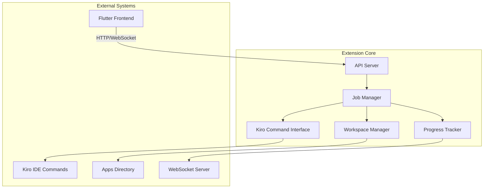
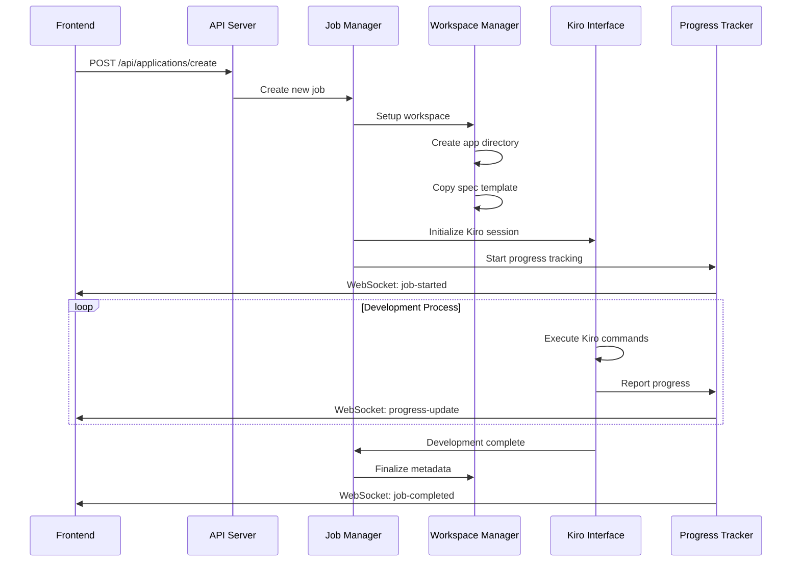
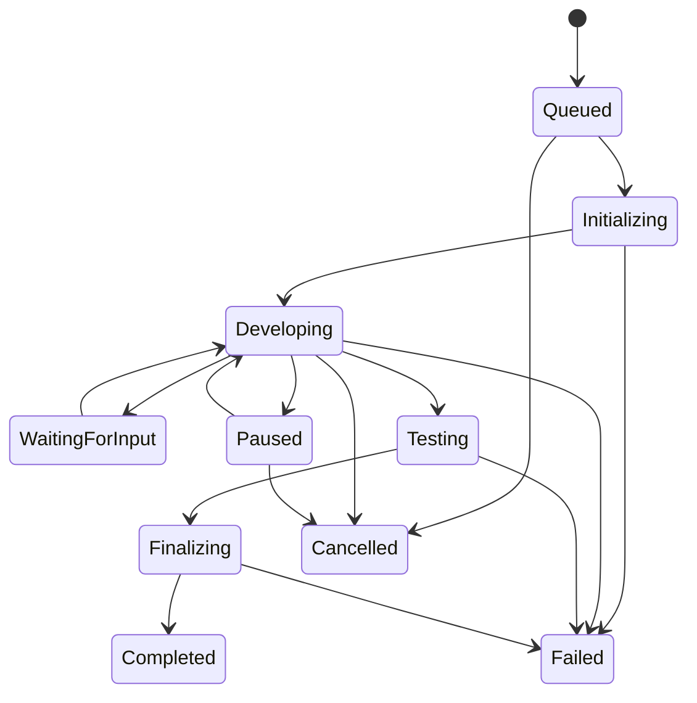

# Design Document

## Overview

The Kiro Orchestration Extension is a TypeScript-based VS Code extension that transforms Kiro IDE into a headless development environment for the Household Software Engineer system. The extension provides a REST API and WebSocket server that enables the Flutter frontend to orchestrate automated application development through Kiro's command system.

The design follows a modular architecture with clear separation between API handling, Kiro command execution, workspace management, and real-time communication. The extension leverages the existing kiro-command-research findings to interact with Kiro's internal command system while providing a stable, well-documented interface for external integration.

## Architecture

### High-Level Architecture



### Component Interaction Flow



## Components and Interfaces

### 1. API Server Component

**Purpose:** Provides REST endpoints for frontend communication and request handling.

**Key Classes:**
- `ApiServer` - Express.js server setup and middleware configuration
- `ApplicationController` - Handles application-related API endpoints
- `JobController` - Manages job lifecycle operations
- `ValidationMiddleware` - Request validation and error handling

**API Endpoints:**
```typescript
interface ApiEndpoints {
  // Application Management
  'POST /api/applications/create': (request: CreateApplicationRequest) => CreateApplicationResponse;
  'GET /api/applications': () => ApplicationListResponse;
  'GET /api/applications/:id': (id: string) => ApplicationDetailResponse;
  'DELETE /api/applications/:id': (id: string) => void;
  
  // Job Control
  'POST /api/applications/:id/pause': (id: string) => JobControlResponse;
  'POST /api/applications/:id/resume': (id: string) => JobControlResponse;
  'POST /api/applications/:id/cancel': (id: string) => JobControlResponse;
  
  // User Interaction
  'POST /api/applications/:id/input': (id: string, input: UserInputRequest) => UserInputResponse;
  'GET /api/applications/:id/logs': (id: string) => LogsResponse;
}
```

### 2. Job Manager Component

**Purpose:** Orchestrates the complete application development lifecycle and manages concurrent jobs.

**Key Classes:**
- `JobManager` - Central coordinator for all development jobs
- `DevelopmentJob` - Represents a single application development process
- `JobQueue` - Manages job prioritization and resource allocation
- `JobState` - Tracks job status and progress information

**Job State Machine:**


### 3. Kiro Command Interface Component

**Purpose:** Provides a clean abstraction layer for executing Kiro IDE commands and capturing results.

**Key Classes:**
- `KiroCommandExecutor` - Executes Kiro commands and captures output
- `CommandResultParser` - Parses command outputs and extracts progress information
- `KiroSessionManager` - Manages multiple concurrent Kiro sessions
- `SpecDrivenDevelopment` - Implements spec-driven development workflow using Kiro

**Command Execution Pattern:**
```typescript
interface KiroCommandInterface {
  executeCommand(command: string, args: string[], workspacePath: string): Promise<CommandResult>;
  createSpecFile(description: string, workspacePath: string): Promise<void>;
  startDevelopment(specPath: string, workspacePath: string): Promise<DevelopmentSession>;
  monitorProgress(sessionId: string): AsyncIterator<ProgressUpdate>;
  handleUserInput(sessionId: string, input: string): Promise<void>;
}
```

### 4. Workspace Manager Component

**Purpose:** Manages application workspaces, file operations, and metadata persistence.

**Key Classes:**
- `WorkspaceManager` - Creates and manages application workspaces
- `SpecTemplateManager` - Handles spec template copying and customization
- `MetadataManager` - Manages application metadata files
- `GitManager` - Handles Git repository initialization and operations

**Workspace Structure:**
```
apps/
├── {app-id}/
│   ├── metadata.json          # Application metadata
│   ├── .kiro/
│   │   ├── specs/
│   │   │   ├── requirements.md
│   │   │   ├── design.md
│   │   │   └── tasks.md
│   │   └── steering/
│   │       └── coding-standards.md
│   ├── src/                   # Generated application code
│   ├── tests/                 # Generated tests
│   ├── docs/                  # Generated documentation
│   └── .git/                  # Git repository
```

### 5. Progress Tracker Component

**Purpose:** Monitors development progress and provides real-time updates via WebSocket.

**Key Classes:**
- `ProgressTracker` - Tracks and broadcasts progress updates
- `WebSocketServer` - Manages WebSocket connections with frontend
- `ProgressCalculator` - Calculates completion percentages based on development phases
- `EventEmitter` - Handles event broadcasting to connected clients

**Progress Events:**
```typescript
interface ProgressEvents {
  'job-started': { jobId: string; applicationId: string; estimatedDuration: number };
  'phase-changed': { jobId: string; phase: DevelopmentPhase; description: string };
  'progress-update': { jobId: string; percentage: number; currentTask: string };
  'user-input-required': { jobId: string; question: string; inputType: string };
  'development-resumed': { jobId: string; resumedAt: string };
  'job-paused': { jobId: string; pausedAt: string };
  'job-completed': { jobId: string; applicationMetadata: ApplicationMetadata };
  'error': { jobId: string; error: ErrorDetails; recoverable: boolean };
}
```

## Data Models

### Application Metadata Schema

```typescript
interface ApplicationMetadata {
  /** Unique identifier for the application */
  id: string;
  
  /** Human-readable application title */
  title: string;
  
  /** Detailed description of the application's purpose */
  description: string;
  
  /** Current development status */
  status: 'queued' | 'developing' | 'waiting-input' | 'paused' | 'completed' | 'failed' | 'cancelled';
  
  /** Timestamp when the application was created */
  createdAt: string;
  
  /** Timestamp of the last status update */
  updatedAt: string;
  
  /** Current development progress information */
  progress: {
    /** Completion percentage (0-100) */
    percentage: number;
    
    /** Current development phase */
    currentPhase: 'requirements' | 'design' | 'implementation' | 'testing' | 'finalization';
    
    /** Description of current task being performed */
    currentTask: string;
    
    /** Estimated completion timestamp */
    estimatedCompletion?: string;
    
    /** List of completed milestones */
    completedMilestones: string[];
    
    /** List of remaining milestones */
    remainingMilestones: string[];
  };
  
  /** Development job configuration */
  jobConfig: {
    /** Priority level for job processing */
    priority: 'low' | 'normal' | 'high';
    
    /** Maximum development time in milliseconds */
    timeoutMs: number;
    
    /** Whether debug logging is enabled */
    debugLogging: boolean;
  };
  
  /** Error information if development failed */
  error?: {
    /** Error message */
    message: string;
    
    /** Error code for programmatic handling */
    code: string;
    
    /** Whether the error is recoverable */
    recoverable: boolean;
    
    /** Timestamp when the error occurred */
    occurredAt: string;
  };
  
  /** Paths to important files within the workspace */
  files: {
    /** Path to the main application entry point */
    mainFile?: string;
    
    /** Path to the README file */
    readme?: string;
    
    /** Path to the package.json or equivalent */
    packageFile?: string;
    
    /** Paths to key source files */
    sourceFiles: string[];
  };
}
```

### Development Job Schema

```typescript
interface DevelopmentJob {
  /** Unique job identifier */
  id: string;
  
  /** Associated application ID */
  applicationId: string;
  
  /** Current job status */
  status: JobStatus;
  
  /** Job creation timestamp */
  createdAt: Date;
  
  /** Job start timestamp */
  startedAt?: Date;
  
  /** Job completion timestamp */
  completedAt?: Date;
  
  /** Original user request */
  userRequest: {
    /** Natural language description */
    description: string;
    
    /** Optional conversation context */
    conversationId?: string;
    
    /** Job priority */
    priority: 'low' | 'normal' | 'high';
  };
  
  /** Current Kiro session information */
  kiroSession?: {
    /** Session ID */
    sessionId: string;
    
    /** Workspace path */
    workspacePath: string;
    
    /** Active command process ID */
    processId?: number;
  };
  
  /** Progress tracking information */
  progress: {
    /** Current completion percentage */
    percentage: number;
    
    /** Current development phase */
    phase: DevelopmentPhase;
    
    /** Phase start timestamp */
    phaseStartedAt: Date;
    
    /** List of completed tasks */
    completedTasks: string[];
    
    /** Current task being executed */
    currentTask?: string;
  };
  
  /** User interaction state */
  userInteraction?: {
    /** Whether waiting for user input */
    waitingForInput: boolean;
    
    /** Question posed to user */
    question?: string;
    
    /** Expected input type */
    inputType?: 'text' | 'choice' | 'file';
    
    /** Timestamp when input was requested */
    requestedAt?: Date;
  };
  
  /** Job execution logs */
  logs: JobLogEntry[];
}
```

## Error Handling

### Error Classification

The extension implements a comprehensive error handling system with the following error categories:

1. **Validation Errors** - Invalid request data or parameters
2. **Workspace Errors** - File system operations and workspace management
3. **Kiro Integration Errors** - Command execution and session management
4. **Network Errors** - API communication and WebSocket issues
5. **System Errors** - Resource constraints and unexpected failures

### Error Recovery Strategies

```typescript
interface ErrorRecoveryStrategy {
  /** Determines if an error is recoverable */
  isRecoverable(error: Error): boolean;
  
  /** Attempts to recover from the error */
  recover(job: DevelopmentJob, error: Error): Promise<RecoveryResult>;
  
  /** Provides user-friendly error messages */
  getUserMessage(error: Error): string;
  
  /** Suggests corrective actions */
  getSuggestedActions(error: Error): string[];
}
```

**Recovery Mechanisms:**
- Automatic retry with exponential backoff for transient failures
- Workspace cleanup and recreation for corrupted workspaces
- Kiro session restart for command execution failures
- Graceful degradation for non-critical feature failures
- User notification and manual intervention for unrecoverable errors

## Testing Strategy

### Unit Testing

**Test Coverage Requirements:**
- All public methods and interfaces: 100%
- Error handling paths: 100%
- Business logic components: 95%
- Integration points: 90%

**Key Test Categories:**
- API endpoint validation and response handling
- Job lifecycle management and state transitions
- Kiro command execution and result parsing
- Workspace creation and file operations
- Progress tracking and WebSocket communication
- Error scenarios and recovery mechanisms

### Integration Testing

**Test Scenarios:**
- End-to-end application creation workflow
- Concurrent job processing and resource management
- WebSocket connection handling and reconnection
- File system operations across different platforms
- Kiro command integration with various project types
- Error propagation and user notification flows

### Performance Testing

**Performance Requirements:**
- API response time: < 200ms for standard operations
- WebSocket message latency: < 50ms
- Concurrent job limit: 5 simultaneous development jobs
- Memory usage: < 500MB per active job
- File system operations: < 1s for workspace creation

### Mock Strategy

**External Dependencies:**
- Mock Kiro command execution for unit tests
- Mock file system operations for cross-platform testing
- Mock WebSocket connections for communication testing
- Mock frontend API calls for integration testing
- Stub time-dependent operations for deterministic testing

## Security Considerations

### Input Validation

- Sanitize all user input to prevent injection attacks
- Validate file paths to prevent directory traversal
- Limit request payload sizes to prevent DoS attacks
- Implement rate limiting for API endpoints
- Validate WebSocket message formats and sizes

### Workspace Isolation

- Ensure each application workspace is properly sandboxed
- Prevent access to files outside the designated apps directory
- Implement proper file permissions and access controls
- Monitor and limit resource usage per workspace
- Clean up temporary files and processes on job completion

### Authentication and Authorization

- Implement API key authentication for frontend communication
- Validate request origins to prevent CSRF attacks
- Log all API access for security auditing
- Implement session management for WebSocket connections
- Provide secure error messages that don't leak sensitive information

## Deployment and Configuration

### Extension Configuration

```typescript
interface ExtensionConfiguration {
  /** API server configuration */
  api: {
    /** Port for HTTP API server */
    port: number;
    
    /** Host address to bind to */
    host: string;
    
    /** API key for authentication */
    apiKey: string;
    
    /** Request timeout in milliseconds */
    timeoutMs: number;
  };
  
  /** WebSocket server configuration */
  websocket: {
    /** Port for WebSocket server */
    port: number;
    
    /** Maximum concurrent connections */
    maxConnections: number;
    
    /** Connection timeout in milliseconds */
    connectionTimeoutMs: number;
  };
  
  /** Workspace management configuration */
  workspace: {
    /** Base directory for all applications */
    appsDirectory: string;
    
    /** Path to spec template directory */
    specTemplatePath: string;
    
    /** Maximum workspace size in MB */
    maxWorkspaceSizeMb: number;
  };
  
  /** Job processing configuration */
  jobs: {
    /** Maximum concurrent jobs */
    maxConcurrentJobs: number;
    
    /** Default job timeout in milliseconds */
    defaultTimeoutMs: number;
    
    /** Job cleanup interval in milliseconds */
    cleanupIntervalMs: number;
  };
  
  /** Logging configuration */
  logging: {
    /** Log level */
    level: 'debug' | 'info' | 'warn' | 'error';
    
    /** Log file path */
    logFilePath: string;
    
    /** Maximum log file size in MB */
    maxLogSizeMb: number;
  };
}
```

### Installation and Setup

1. **Extension Installation** - Install via VS Code marketplace or manual VSIX installation
2. **Configuration** - Set up API keys, ports, and workspace directories
3. **Dependency Verification** - Ensure Kiro IDE is properly installed and accessible
4. **Template Setup** - Configure spec templates and coding standards
5. **Testing** - Verify API endpoints and WebSocket connectivity
6. **Integration** - Connect with Flutter frontend and test end-to-end workflow