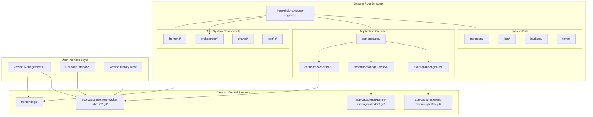

# Design Document

## Overview

The Project Architecture establishes a robust, scalable directory structure with complete application isolation through individual Git repositories. The design emphasizes separation of concerns, independent versioning, and user-friendly version management while maintaining system integrity and performance. Each application capsule operates as a completely independent entity with its own development lifecycle, dependencies, and version history.

## Architecture



## Directory Structure

### Root System Organization

```
household-software-engineer/
├── frontend/                          # Flutter desktop application
│   ├── .git/                         # Frontend version control
│   ├── lib/
│   ├── test/
│   ├── pubspec.yaml
│   └── README.md
│
├── orchestrator/                      # Node.js orchestration service
│   ├── src/
│   ├── test/
│   ├── package.json
│   ├── tsconfig.json
│   └── README.md
│
├── shared/                           # Shared utilities and types
│   ├── types/
│   ├── utils/
│   └── README.md
│
├── config/                           # System configuration
│   ├── development.json
│   ├── production.json
│   └── schema.json
│
├── app-capsules/                     # Individual application containers
│   ├── chore-tracker-abc123/         # Example application capsule
│   ├── expense-manager-def456/       # Example application capsule
│   └── event-planner-ghi789/         # Example application capsule
│
├── metadata/                         # System metadata storage
│   ├── applications.json
│   ├── users.json
│   └── system-state.json
│
├── logs/                            # System and application logs
│   ├── orchestrator/
│   ├── applications/
│   └── system/
│
├── backups/                         # Automated backup storage
│   ├── daily/
│   ├── weekly/
│   └── monthly/
│
├── temp/                           # Temporary files and processing
│   ├── builds/
│   ├── downloads/
│   └── cache/
│
├── docker-compose.yml              # Container orchestration
├── .gitignore                      # Root gitignore
└── README.md                       # System documentation
```

### Application Capsule Structure

Each application capsule is a completely self-contained directory with its own Git repository:

```
app-capsules/chore-tracker-abc123/
├── .git/                           # Independent Git repository
│   ├── hooks/                      # Custom Git hooks for automation
│   ├── refs/
│   │   └── tags/                   # Version tags (v1.0.0, v1.1.0, etc.)
│   └── objects/
│
├── src/                           # Application source code
│   ├── components/
│   ├── services/
│   ├── models/
│   └── main.js
│
├── tests/                         # Application test suites
│   ├── unit/
│   ├── integration/
│   └── e2e/
│
├── docs/                          # Application documentation
│   ├── README.md
│   ├── API.md
│   └── CHANGELOG.md
│
├── container/                     # Container configuration
│   ├── Dockerfile
│   ├── docker-compose.yml
│   └── .dockerignore
│
├── data/                          # Application-specific data
│   ├── database/
│   ├── uploads/
│   └── cache/
│
├── config/                        # Application configuration
│   ├── development.json
│   ├── production.json
│   └── secrets.json
│
├── scripts/                       # Build and deployment scripts
│   ├── build.sh
│   ├── deploy.sh
│   └── test.sh
│
├── .env.example                   # Environment template
├── .gitignore                     # Application-specific gitignore
├── package.json                   # Dependencies and scripts
├── manifest.json                  # Application metadata
└── VERSION                        # Current version identifier
```

## Version Control Architecture

### Git Repository Strategy

**Independent Repositories**: Each application capsule and the frontend maintain separate Git repositories to ensure complete isolation and independent version management.

**Automated Commits**: Kiro automatically creates meaningful commits during development with structured commit messages following conventional commit standards.

**Semantic Versioning**: All applications use semantic versioning (MAJOR.MINOR.PATCH) with automatic version bumping based on change types.

**Tagged Releases**: Each significant milestone creates a Git tag for easy rollback and version identification.

### Version Control Models

```typescript
interface VersionInfo {
  version: string;              // Semantic version (e.g., "1.2.3")
  tag: string;                 // Git tag name (e.g., "v1.2.3")
  commitHash: string;          // Full commit SHA
  shortHash: string;           // Abbreviated commit SHA
  timestamp: Date;             // Creation timestamp
  author: string;              // Author information
  message: string;             // Commit message
  changes: ChangeSet[];        // Summary of changes
}

interface ChangeSet {
  type: ChangeType;            // feature, bugfix, breaking, etc.
  description: string;         // Human-readable description
  files: string[];            // Affected files
  impact: ImpactLevel;        // low, medium, high
}

enum ChangeType {
  FEATURE = 'feature',
  BUGFIX = 'bugfix',
  BREAKING = 'breaking',
  PERFORMANCE = 'performance',
  SECURITY = 'security',
  DOCUMENTATION = 'documentation'
}
```

### Automated Version Management

```typescript
class VersionManager {
  /**
   * Creates a new version for an application capsule.
   * 
   * Automatically determines version bump type based on changes,
   * creates appropriate Git commit and tag, and updates metadata.
   */
  async createVersion(
    capsuleId: string,
    changes: ChangeSet[],
    options: VersionOptions = {}
  ): Promise<VersionInfo> {
    // 1. Analyze changes to determine version bump type
    const bumpType = this.determineBumpType(changes);
    
    // 2. Calculate new version number
    const currentVersion = await this.getCurrentVersion(capsuleId);
    const newVersion = this.bumpVersion(currentVersion, bumpType);
    
    // 3. Create Git commit with structured message
    const commitMessage = this.generateCommitMessage(changes, newVersion);
    const commitHash = await this.createCommit(capsuleId, commitMessage);
    
    // 4. Create Git tag for the release
    const tagName = `v${newVersion}`;
    await this.createTag(capsuleId, tagName, commitHash);
    
    // 5. Update application metadata
    await this.updateVersionMetadata(capsuleId, newVersion, changes);
    
    return {
      version: newVersion,
      tag: tagName,
      commitHash,
      shortHash: commitHash.substring(0, 8),
      timestamp: new Date(),
      author: 'Kiro Development Agent',
      message: commitMessage,
      changes
    };
  }

  /**
   * Rolls back an application to a previous version.
   * 
   * Creates a new commit that reverts to the specified version
   * while preserving history for audit purposes.
   */
  async rollbackToVersion(
    capsuleId: string,
    targetVersion: string,
    reason: string
  ): Promise<RollbackResult> {
    // 1. Validate target version exists
    const targetTag = `v${targetVersion}`;
    const tagExists = await this.tagExists(capsuleId, targetTag);
    if (!tagExists) {
      throw new Error(`Version ${targetVersion} not found`);
    }
    
    // 2. Create rollback commit
    const rollbackMessage = `Rollback to version ${targetVersion}: ${reason}`;
    await this.revertToTag(capsuleId, targetTag, rollbackMessage);
    
    // 3. Update metadata and notify systems
    await this.updateRollbackMetadata(capsuleId, targetVersion, reason);
    await this.notifyRollbackComplete(capsuleId, targetVersion);
    
    return {
      success: true,
      previousVersion: await this.getCurrentVersion(capsuleId),
      newVersion: targetVersion,
      rollbackCommit: await this.getLatestCommitHash(capsuleId)
    };
  }
}
```

## User Interface Design

### Version Management Interface

The frontend provides a clean, non-technical interface for version management:

```dart
/// Version history widget showing application versions in chronological order
class VersionHistoryWidget extends StatelessWidget {
  final String applicationId;
  
  @override
  Widget build(BuildContext context) {
    return Consumer<VersionProvider>(
      builder: (context, versionProvider, child) {
        final versions = versionProvider.getVersionHistory(applicationId);
        
        return ListView.builder(
          itemCount: versions.length,
          itemBuilder: (context, index) {
            final version = versions[index];
            return VersionTile(
              version: version,
              isCurrentVersion: index == 0,
              onRollback: () => _showRollbackDialog(context, version),
              onViewChanges: () => _showChangesDialog(context, version),
            );
          },
        );
      },
    );
  }
}

/// Individual version tile with user-friendly information
class VersionTile extends StatelessWidget {
  final VersionInfo version;
  final bool isCurrentVersion;
  final VoidCallback onRollback;
  final VoidCallback onViewChanges;
  
  @override
  Widget build(BuildContext context) {
    return Card(
      child: ListTile(
        leading: _buildVersionIcon(),
        title: Text('Version ${version.version}'),
        subtitle: Column(
          crossAxisAlignment: CrossAxisAlignment.start,
          children: [
            Text(_formatTimestamp(version.timestamp)),
            Text(_summarizeChanges(version.changes)),
          ],
        ),
        trailing: isCurrentVersion 
          ? Chip(label: Text('Current'))
          : PopupMenuButton(
              itemBuilder: (context) => [
                PopupMenuItem(
                  child: Text('View Changes'),
                  onTap: onViewChanges,
                ),
                PopupMenuItem(
                  child: Text('Rollback to This Version'),
                  onTap: onRollback,
                ),
              ],
            ),
      ),
    );
  }
  
  Widget _buildVersionIcon() {
    // Different icons based on change types
    if (version.changes.any((c) => c.type == ChangeType.BREAKING)) {
      return Icon(Icons.warning, color: Colors.orange);
    } else if (version.changes.any((c) => c.type == ChangeType.FEATURE)) {
      return Icon(Icons.new_releases, color: Colors.green);
    } else {
      return Icon(Icons.build, color: Colors.blue);
    }
  }
}
```

### Rollback Interface

```dart
/// Dialog for confirming version rollback with impact preview
class RollbackDialog extends StatefulWidget {
  final VersionInfo targetVersion;
  final VersionInfo currentVersion;
  
  @override
  _RollbackDialogState createState() => _RollbackDialogState();
}

class _RollbackDialogState extends State<RollbackDialog> {
  String rollbackReason = '';
  bool showImpactAnalysis = false;
  
  @override
  Widget build(BuildContext context) {
    return AlertDialog(
      title: Text('Rollback to Version ${widget.targetVersion.version}'),
      content: Column(
        mainAxisSize: MainAxisSize.min,
        children: [
          Text(
            'This will revert your application to an earlier version. '
            'Your current changes will be preserved in the version history.',
          ),
          SizedBox(height: 16),
          TextField(
            decoration: InputDecoration(
              labelText: 'Reason for rollback (optional)',
              hintText: 'e.g., "Fixed critical bug in latest version"',
            ),
            onChanged: (value) => rollbackReason = value,
          ),
          SizedBox(height: 16),
          ExpansionTile(
            title: Text('What will change?'),
            children: [
              _buildImpactAnalysis(),
            ],
          ),
        ],
      ),
      actions: [
        TextButton(
          onPressed: () => Navigator.of(context).pop(),
          child: Text('Cancel'),
        ),
        ElevatedButton(
          onPressed: _performRollback,
          child: Text('Rollback'),
        ),
      ],
    );
  }
  
  Widget _buildImpactAnalysis() {
    // Show what features/changes will be lost or restored
    return Column(
      children: [
        Text('Features that will be restored:'),
        ...widget.targetVersion.changes
          .where((c) => c.type == ChangeType.FEATURE)
          .map((c) => ListTile(
            leading: Icon(Icons.add, color: Colors.green),
            title: Text(c.description),
          )),
        Text('Recent changes that will be undone:'),
        ...widget.currentVersion.changes
          .where((c) => !widget.targetVersion.changes.contains(c))
          .map((c) => ListTile(
            leading: Icon(Icons.remove, color: Colors.red),
            title: Text(c.description),
          )),
      ],
    );
  }
}
```

## Backup and Recovery Strategy

### Automated Backup System

```typescript
class BackupManager {
  /**
   * Creates comprehensive backups of all Git repositories and metadata.
   * 
   * Backups include complete Git history, application data, and system state
   * with configurable retention policies and compression.
   */
  async createSystemBackup(options: BackupOptions = {}): Promise<BackupResult> {
    const backupId = this.generateBackupId();
    const backupPath = path.join(this.backupDirectory, backupId);
    
    try {
      // 1. Create backup directory structure
      await this.createBackupStructure(backupPath);
      
      // 2. Backup all application capsules
      const capsules = await this.getAllCapsules();
      for (const capsule of capsules) {
        await this.backupCapsule(capsule.id, backupPath);
      }
      
      // 3. Backup frontend repository
      await this.backupFrontend(backupPath);
      
      // 4. Backup system metadata
      await this.backupMetadata(backupPath);
      
      // 5. Create backup manifest
      const manifest = await this.createBackupManifest(backupPath, capsules);
      
      // 6. Compress and finalize backup
      const compressedPath = await this.compressBackup(backupPath);
      
      return {
        backupId,
        path: compressedPath,
        size: await this.getBackupSize(compressedPath),
        capsuleCount: capsules.length,
        timestamp: new Date(),
        manifest
      };
    } catch (error) {
      await this.cleanupFailedBackup(backupPath);
      throw new BackupError(`Backup failed: ${error.message}`, { backupId });
    }
  }

  /**
   * Restores a specific application capsule from backup.
   * 
   * Allows selective restoration without affecting other applications
   * or system components.
   */
  async restoreCapsule(
    backupId: string,
    capsuleId: string,
    options: RestoreOptions = {}
  ): Promise<RestoreResult> {
    const backupPath = await this.extractBackup(backupId);
    const capsulePath = path.join(backupPath, 'capsules', capsuleId);
    
    if (!await this.pathExists(capsulePath)) {
      throw new RestoreError(`Capsule ${capsuleId} not found in backup ${backupId}`);
    }
    
    // 1. Create temporary restoration area
    const tempPath = await this.createTempRestoreArea();
    
    try {
      // 2. Restore Git repository
      await this.restoreGitRepository(capsulePath, tempPath);
      
      // 3. Validate repository integrity
      await this.validateRestoredRepository(tempPath);
      
      // 4. Move to final location (atomic operation)
      const finalPath = this.getCapsulePath(capsuleId);
      await this.atomicMove(tempPath, finalPath);
      
      // 5. Update system metadata
      await this.updateCapsuleMetadata(capsuleId, 'restored');
      
      return {
        success: true,
        capsuleId,
        restoredPath: finalPath,
        backupSource: backupId,
        timestamp: new Date()
      };
    } catch (error) {
      await this.cleanupTempRestore(tempPath);
      throw new RestoreError(`Restore failed: ${error.message}`, { capsuleId, backupId });
    }
  }
}
```

## Performance and Optimization

### Git Repository Optimization

```typescript
class RepositoryOptimizer {
  /**
   * Optimizes Git repositories to maintain performance as they grow.
   * 
   * Includes garbage collection, pack optimization, and selective
   * history compression while preserving important version tags.
   */
  async optimizeRepository(capsuleId: string): Promise<OptimizationResult> {
    const repoPath = this.getCapsuleGitPath(capsuleId);
    
    // 1. Run Git garbage collection
    await this.runGitGC(repoPath);
    
    // 2. Optimize pack files
    await this.optimizePackFiles(repoPath);
    
    // 3. Prune unreachable objects
    await this.pruneUnreachableObjects(repoPath);
    
    // 4. Compress loose objects
    await this.compressLooseObjects(repoPath);
    
    // 5. Update repository statistics
    const stats = await this.getRepositoryStats(repoPath);
    
    return {
      capsuleId,
      sizeBefore: stats.sizeBefore,
      sizeAfter: stats.sizeAfter,
      spaceSaved: stats.sizeBefore - stats.sizeAfter,
      optimizationTime: stats.duration,
      objectCount: stats.objectCount
    };
  }
}
```

## Security Considerations

### Repository Access Control

```typescript
interface SecurityPolicy {
  capsuleId: string;
  allowedOperations: GitOperation[];
  accessRestrictions: AccessRestriction[];
  auditLogging: boolean;
  encryptionRequired: boolean;
}

class RepositorySecurityManager {
  /**
   * Enforces security policies for Git operations.
   * 
   * Ensures that only authorized operations are performed
   * and all access is properly logged and audited.
   */
  async validateOperation(
    capsuleId: string,
    operation: GitOperation,
    context: SecurityContext
  ): Promise<ValidationResult> {
    const policy = await this.getSecurityPolicy(capsuleId);
    
    // 1. Check operation permissions
    if (!policy.allowedOperations.includes(operation)) {
      throw new SecurityError(`Operation ${operation} not allowed for capsule ${capsuleId}`);
    }
    
    // 2. Validate access restrictions
    for (const restriction of policy.accessRestrictions) {
      await this.validateRestriction(restriction, context);
    }
    
    // 3. Log security event
    if (policy.auditLogging) {
      await this.logSecurityEvent(capsuleId, operation, context);
    }
    
    return { allowed: true, restrictions: policy.accessRestrictions };
  }
}
```

This architecture provides a robust foundation for application isolation, version control, and user-friendly version management while maintaining security and performance at scale.