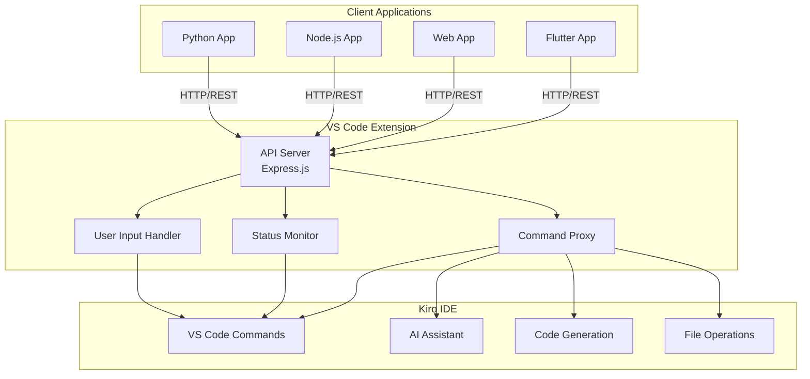
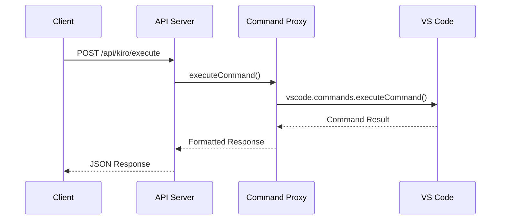
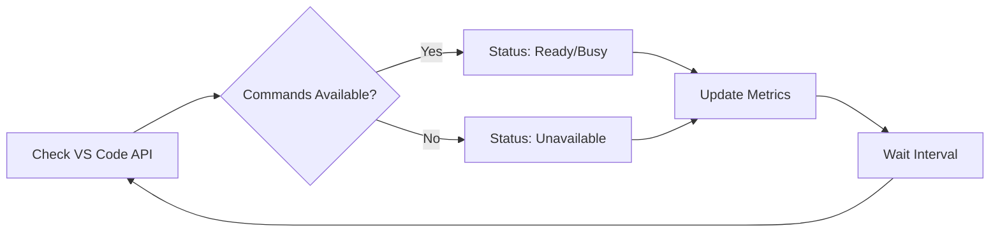
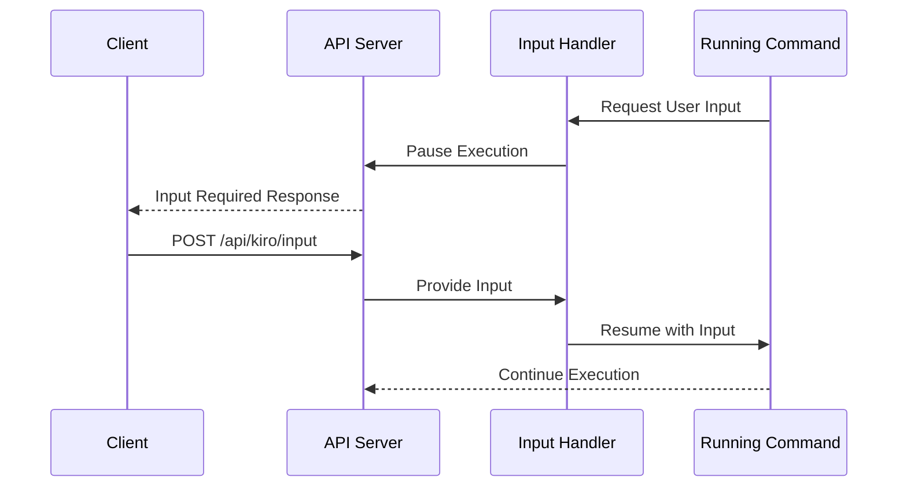
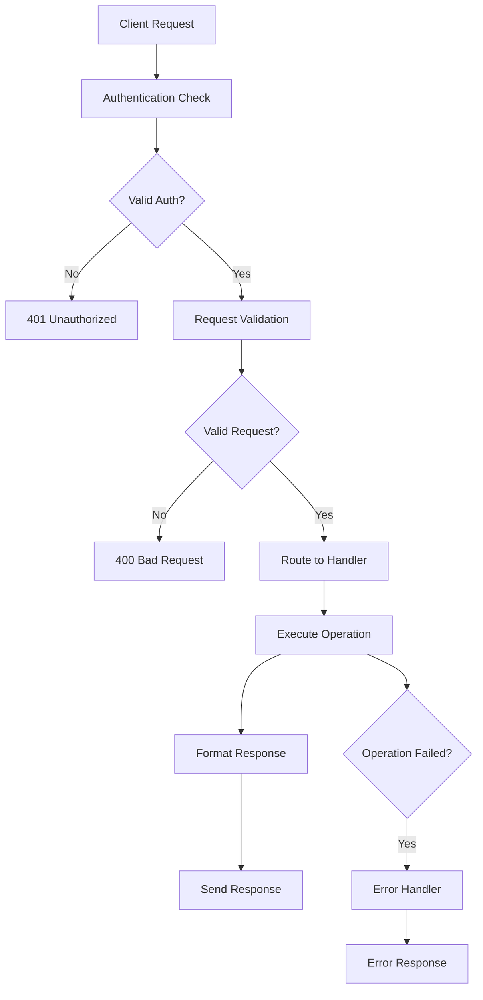
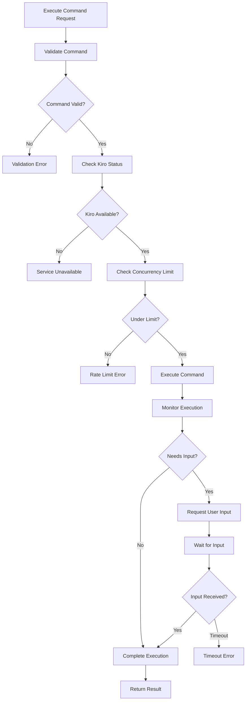
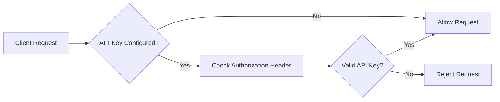
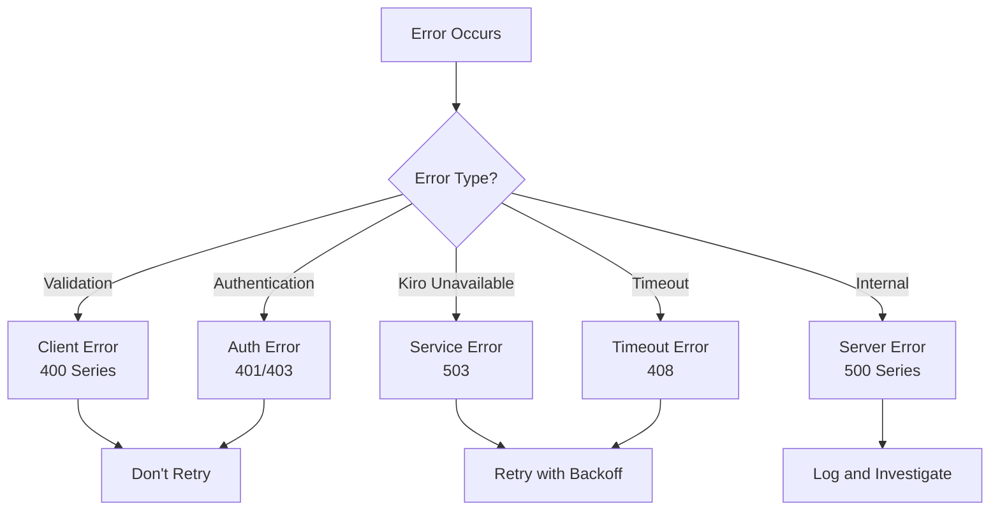
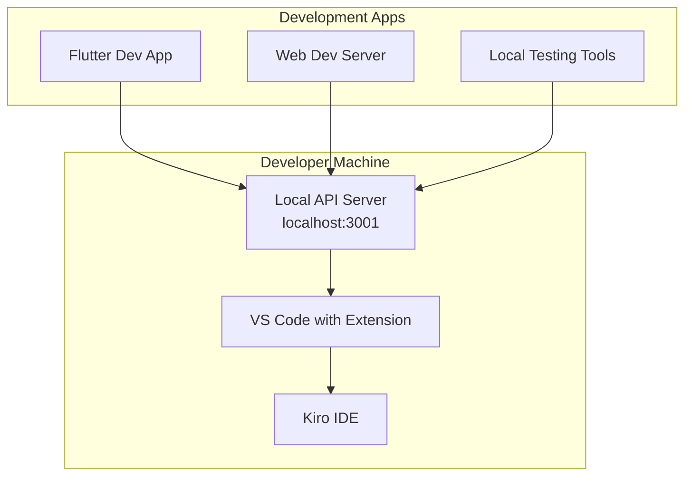

# System Architecture

Understanding the architecture of the Kiro Communication Bridge helps you integrate effectively and troubleshoot issues. This document provides a comprehensive overview of the system components and their interactions.

## High-Level Architecture



## Core Components

### 1. API Server (Express.js)

The central HTTP server that exposes REST endpoints for external applications.

**Responsibilities**:
- Handle HTTP requests and responses
- Route requests to appropriate handlers
- Manage authentication and authorization
- Implement CORS and security policies
- Provide error handling and logging

**Key Features**:
- RESTful API design
- JSON request/response format
- Optional API key authentication
- Configurable timeouts and limits
- Comprehensive error responses

**Configuration**:
```json
{
  "kiroOrchestration.api.port": 3001,
  "kiroOrchestration.api.host": "localhost",
  "kiroOrchestration.api.enableCors": true,
  "kiroOrchestration.api.timeoutMs": 30000,
  "kiroOrchestration.api.maxBodySize": "10mb"
}
```

### 2. Command Proxy

Bridges external API requests to internal VS Code commands.

**Responsibilities**:
- Execute VS Code commands programmatically
- Manage command execution lifecycle
- Handle command timeouts and cancellation
- Track active command executions
- Format command results for API responses

**Command Flow**:


**Features**:
- Concurrent command execution (configurable limit)
- Command timeout management
- Output capture and formatting
- Error handling and recovery

### 3. Status Monitor

Continuously monitors Kiro IDE availability and status.

**Responsibilities**:
- Check Kiro IDE responsiveness
- Discover available commands
- Track system health metrics
- Provide status information to clients
- Detect status changes and availability

**Monitoring Cycle**:


**Health Metrics**:
- Response time tracking
- Failure rate monitoring
- Uptime percentage calculation
- Command availability tracking

### 4. User Input Handler

Manages interactive command sessions that require user input.

**Responsibilities**:
- Handle user input requests from commands
- Manage input timeouts and validation
- Coordinate between API clients and VS Code
- Track pending input requests

**Input Flow**:


## Data Flow

### Request Processing Pipeline



### Command Execution Flow



## Security Architecture

### Authentication Layer



**Security Features**:
- Optional API key authentication
- Bearer token format
- Request origin validation (CORS)
- Input sanitization and validation
- Error message sanitization

### Network Security

**Local-Only Access**:
- Default binding to localhost/127.0.0.1
- No external network exposure by default
- Configurable host binding for specific needs

**Request Validation**:
- JSON schema validation
- Input length limits
- Command name validation
- Argument type checking

## Scalability Considerations

### Concurrency Management

**Command Execution**:
- Maximum concurrent commands (default: 3)
- Command queuing and prioritization
- Timeout management per command
- Resource cleanup on completion

**Request Handling**:
- Express.js built-in request queuing
- Configurable request timeouts
- Body size limits
- Connection pooling support

### Performance Optimization

**Caching Strategy**:
- Command availability caching
- Status response caching
- Connection reuse for HTTP clients

**Resource Management**:
- Memory usage monitoring
- Automatic cleanup of completed executions
- Configurable history limits
- Garbage collection optimization

## Error Handling Architecture

### Error Classification



### Recovery Mechanisms

**Automatic Recovery**:
- Connection retry with exponential backoff
- Command execution retry for transient failures
- Status monitoring recovery after failures
- Graceful degradation when services unavailable

**Manual Recovery**:
- Extension restart commands
- Server restart functionality
- Configuration reset options
- Diagnostic tools and logging

## Deployment Architecture

### Development Environment



### Production Considerations

**Single User Environment**:
- Extension runs per VS Code instance
- API server bound to localhost
- No external network access required
- Minimal resource footprint

**Multi-User Scenarios**:
- Each user runs their own extension instance
- Separate API servers per user
- No shared state between instances
- User-specific configuration and authentication

## Integration Patterns

### Client Application Patterns

**Polling Pattern**:
```typescript
// Regular status polling
setInterval(async () => {
  const status = await apiClient.getStatus();
  updateUI(status);
}, 5000);
```

**Command Execution Pattern**:
```typescript
// Execute with error handling
try {
  const result = await apiClient.executeCommand('command.name');
  handleSuccess(result);
} catch (error) {
  handleError(error);
}
```

**Interactive Session Pattern**:
```typescript
// Handle user input requirements
const result = await apiClient.executeCommand('interactive.command');
if (result.requiresInput) {
  const userInput = await getUserInput(result.prompt);
  await apiClient.provideInput(result.executionId, userInput);
}
```

### Extension Integration

**Command Registration**:
```typescript
// Register VS Code commands
vscode.commands.registerCommand('extension.command', handler);
```

**Event Handling**:
```typescript
// Listen for VS Code events
vscode.workspace.onDidChangeConfiguration(handler);
vscode.window.onDidChangeActiveTextEditor(handler);
```

## Monitoring and Observability

### Metrics Collection

**API Metrics**:
- Request count and rate
- Response time distribution
- Error rate by endpoint
- Concurrent request count

**Command Metrics**:
- Command execution count
- Success/failure rates
- Execution time distribution
- Queue depth and wait times

**System Metrics**:
- Memory usage
- CPU utilization
- Network connections
- File descriptor usage

### Logging Strategy

**Log Levels**:
- DEBUG: Detailed execution traces
- INFO: Normal operation events
- WARN: Recoverable error conditions
- ERROR: Serious error conditions

**Log Destinations**:
- VS Code Output panel
- Extension host console
- System logs (optional)
- File logging (configurable)

## Next Steps

- **[Data Flow](/docs/overview/data-flow)** - Detailed data flow diagrams
- **[Integration Patterns](/docs/overview/integration-patterns)** - Common integration approaches
- **[API Reference](/docs/api/overview)** - Complete API documentation
- **[Quick Start Guide](/docs/guides/quick-start)** - Get started with the API