# Data Flow

Understanding how data flows through the Kiro Communication Bridge helps you optimize your integration and troubleshoot issues. This document provides detailed diagrams and explanations of data movement patterns.

## Request-Response Flow

### Basic API Request Flow

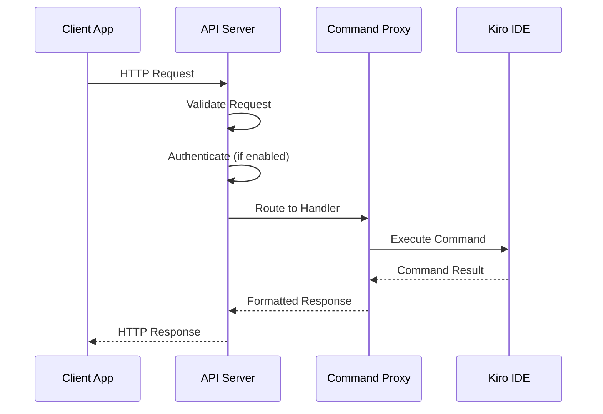
```mermaid
sequenceDiagram
    participant C as Client App
    participant A as API Server
    participant P as Command Proxy
    participant K as Kiro IDE

    C->>A: HTTP Request
    A->>A: Validate Request
    A->>A: Authenticate (if enabled)
    A->>P: Route to Handler
    P->>K: Execute Command
    K-->>P: Command Result
    P-->>A: Formatted Response
    A-->>C: HTTP Response
```

### Error Handling Flow

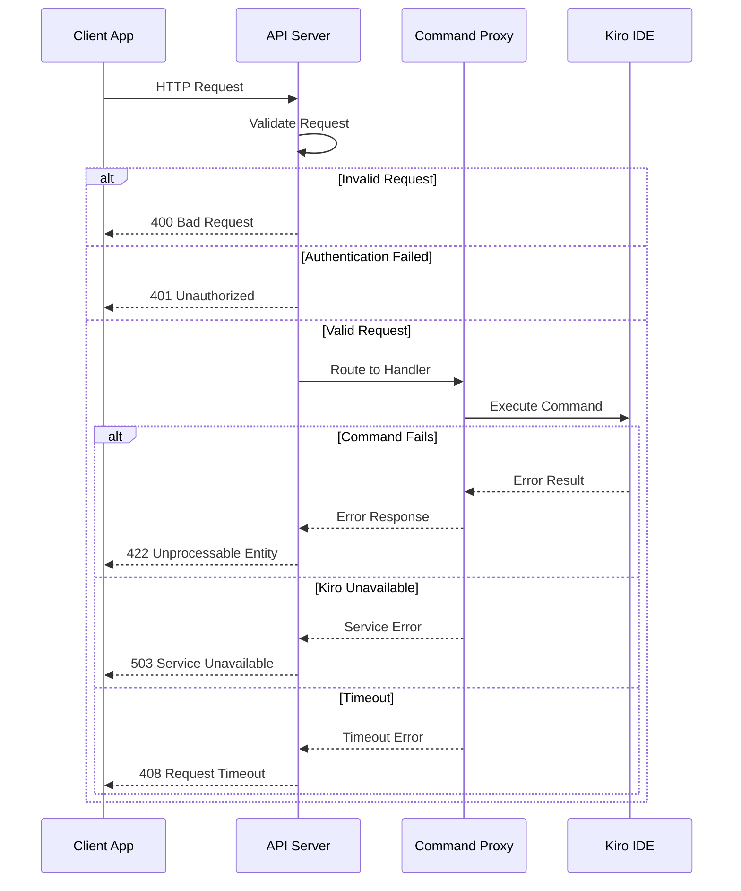
```mermaid
sequenceDiagram
    participant C as Client App
    participant A as API Server
    participant P as Command Proxy
    participant K as Kiro IDE

    C->>A: HTTP Request
    A->>A: Validate Request
    alt Invalid Request
        A-->>C: 400 Bad Request
    else Authentication Failed
        A-->>C: 401 Unauthorized
    else Valid Request
        A->>P: Route to Handler
        P->>K: Execute Command
        alt Command Fails
            K-->>P: Error Result
            P-->>A: Error Response
            A-->>C: 422 Unprocessable Entity
        else Kiro Unavailable
            P-->>A: Service Error
            A-->>C: 503 Service Unavailable
        else Timeout
            P-->>A: Timeout Error
            A-->>C: 408 Request Timeout
        end
    end
```

## Command Execution Data Flow

### Simple Command Execution

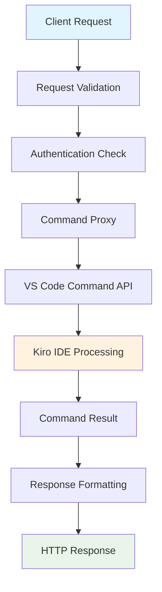
```mermaid
graph TD
    A[Client Request] --> B[Request Validation]
    B --> C[Authentication Check]
    C --> D[Command Proxy]
    D --> E[VS Code Command API]
    E --> F[Kiro IDE Processing]
    F --> G[Command Result]
    G --> H[Response Formatting]
    H --> I[HTTP Response]
    
    style A fill:#e1f5fe
    style I fill:#e8f5e8
    style F fill:#fff3e0
```

### Interactive Command Flow

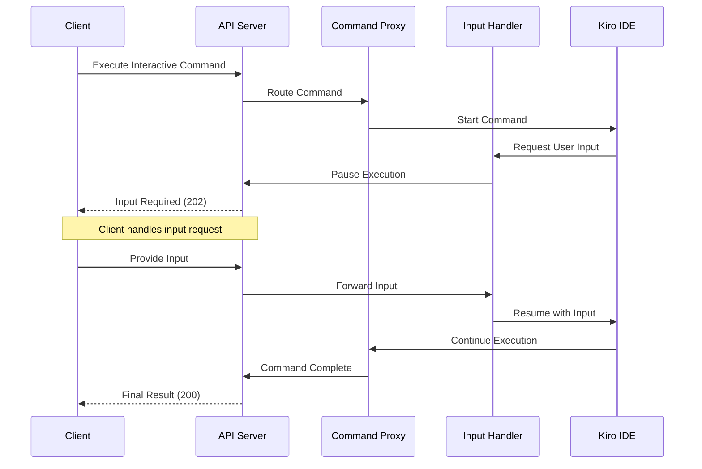
```mermaid
sequenceDiagram
    participant C as Client
    participant A as API Server
    participant P as Command Proxy
    participant H as Input Handler
    participant K as Kiro IDE

    C->>A: Execute Interactive Command
    A->>P: Route Command
    P->>K: Start Command
    K->>H: Request User Input
    H->>A: Pause Execution
    A-->>C: Input Required (202)
    
    Note over C,A: Client handles input request
    
    C->>A: Provide Input
    A->>H: Forward Input
    H->>K: Resume with Input
    K->>P: Continue Execution
    P->>A: Command Complete
    A-->>C: Final Result (200)
```

## Status Monitoring Data Flow

### Continuous Status Monitoring

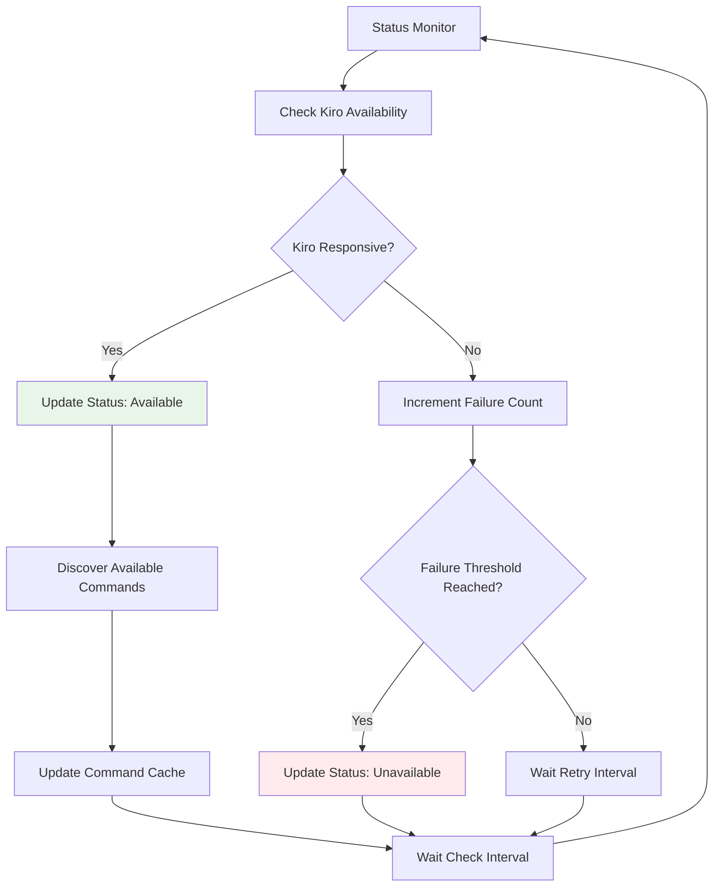
```mermaid
graph TD
    A[Status Monitor] --> B[Check Kiro Availability]
    B --> C{Kiro Responsive?}
    C -->|Yes| D[Update Status: Available]
    C -->|No| E[Increment Failure Count]
    E --> F{Failure Threshold Reached?}
    F -->|No| G[Wait Retry Interval]
    F -->|Yes| H[Update Status: Unavailable]
    D --> I[Discover Available Commands]
    I --> J[Update Command Cache]
    J --> K[Wait Check Interval]
    H --> K
    G --> K
    K --> A
    
    style D fill:#e8f5e8
    style H fill:#ffebee
```

### Status API Response Flow

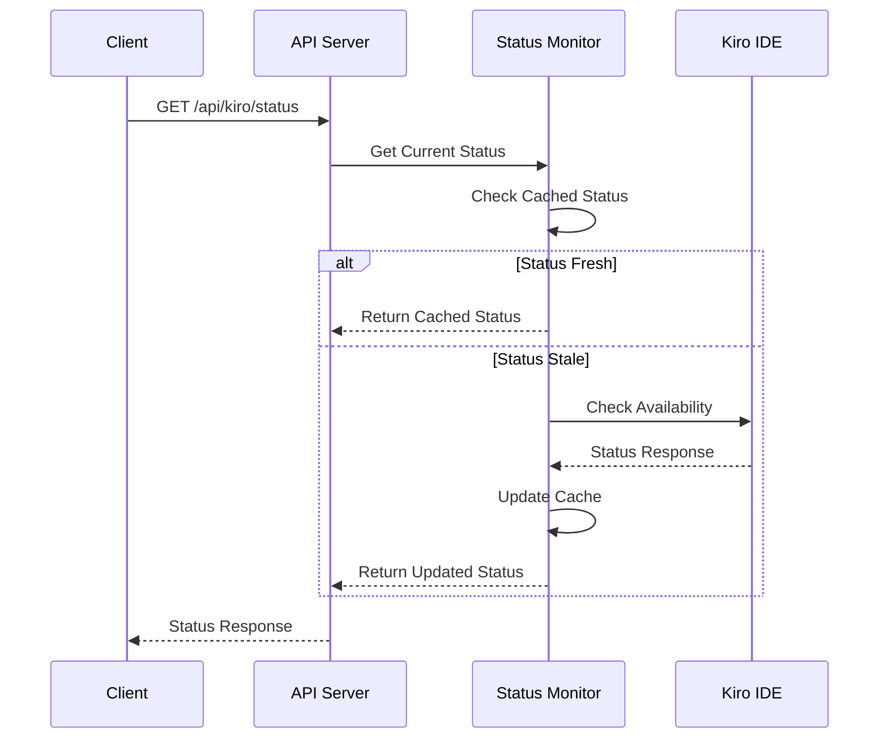
```mermaid
sequenceDiagram
    participant C as Client
    participant A as API Server
    participant S as Status Monitor
    participant K as Kiro IDE

    C->>A: GET /api/kiro/status
    A->>S: Get Current Status
    S->>S: Check Cached Status
    alt Status Fresh
        S-->>A: Return Cached Status
    else Status Stale
        S->>K: Check Availability
        K-->>S: Status Response
        S->>S: Update Cache
        S-->>A: Return Updated Status
    end
    A-->>C: Status Response
```

## Data Transformation Pipeline

### Request Data Transformation

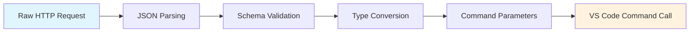
```mermaid
graph LR
    A[Raw HTTP Request] --> B[JSON Parsing]
    B --> C[Schema Validation]
    C --> D[Type Conversion]
    D --> E[Command Parameters]
    E --> F[VS Code Command Call]
    
    style A fill:#e1f5fe
    style F fill:#fff3e0
```

**Transformation Steps**:

1. **HTTP Request Parsing**
   ```typescript
   const rawBody = request.body;
   const contentType = request.headers['content-type'];
   ```

2. **JSON Deserialization**
   ```typescript
   const requestData = JSON.parse(rawBody);
   ```

3. **Schema Validation**
   ```typescript
   const validatedData = validateExecuteCommandRequest(requestData);
   ```

4. **Parameter Extraction**
   ```typescript
   const { command, args, workspacePath } = validatedData;
   ```

5. **Command Execution**
   ```typescript
   const result = await vscode.commands.executeCommand(command, ...args);
   ```

### Response Data Transformation

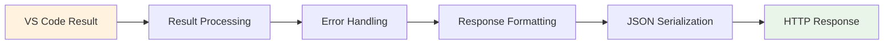
```mermaid
graph LR
    A[VS Code Result] --> B[Result Processing]
    B --> C[Error Handling]
    C --> D[Response Formatting]
    D --> E[JSON Serialization]
    E --> F[HTTP Response]
    
    style A fill:#fff3e0
    style F fill:#e8f5e8
```

**Response Processing**:

1. **Result Capture**
   ```typescript
   try {
     const result = await executeCommand();
     return { success: true, output: result };
   } catch (error) {
     return { success: false, error: error.message };
   }
   ```

2. **Response Formatting**
   ```typescript
   const response = {
     success: result.success,
     output: result.output || '',
     error: result.error || null,
     executionTimeMs: Date.now() - startTime
   };
   ```

3. **HTTP Response**
   ```typescript
   res.status(result.success ? 200 : 422).json(response);
   ```

## Concurrent Request Handling

### Request Queue Management

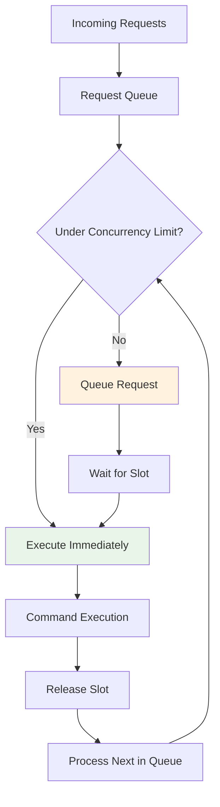
```mermaid
graph TD
    A[Incoming Requests] --> B[Request Queue]
    B --> C{Under Concurrency Limit?}
    C -->|Yes| D[Execute Immediately]
    C -->|No| E[Queue Request]
    E --> F[Wait for Slot]
    F --> D
    D --> G[Command Execution]
    G --> H[Release Slot]
    H --> I[Process Next in Queue]
    I --> C
    
    style E fill:#fff3e0
    style D fill:#e8f5e8
```

### Concurrency Control Flow

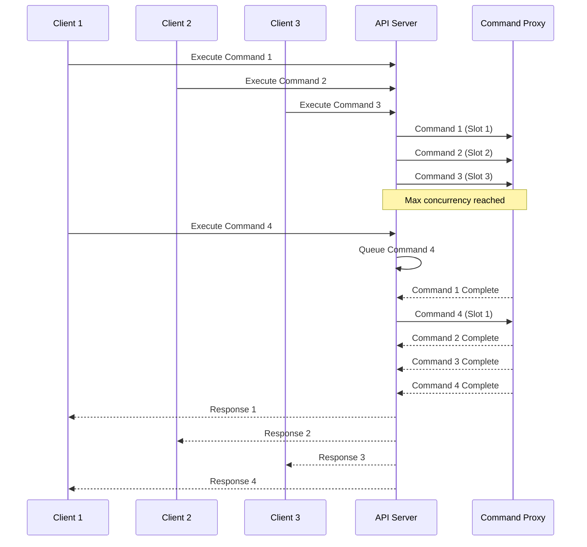
```mermaid
sequenceDiagram
    participant C1 as Client 1
    participant C2 as Client 2
    participant C3 as Client 3
    participant A as API Server
    participant P as Command Proxy

    C1->>A: Execute Command 1
    C2->>A: Execute Command 2
    C3->>A: Execute Command 3
    
    A->>P: Command 1 (Slot 1)
    A->>P: Command 2 (Slot 2)
    A->>P: Command 3 (Slot 3)
    
    Note over A,P: Max concurrency reached
    
    C1->>A: Execute Command 4
    A->>A: Queue Command 4
    
    P-->>A: Command 1 Complete
    A->>P: Command 4 (Slot 1)
    
    P-->>A: Command 2 Complete
    P-->>A: Command 3 Complete
    P-->>A: Command 4 Complete
    
    A-->>C1: Response 1
    A-->>C2: Response 2
    A-->>C3: Response 3
    A-->>C1: Response 4
```

## Memory and Resource Flow

### Memory Usage Patterns

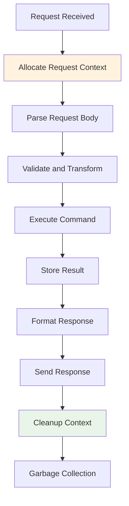
```mermaid
graph TD
    A[Request Received] --> B[Allocate Request Context]
    B --> C[Parse Request Body]
    C --> D[Validate and Transform]
    D --> E[Execute Command]
    E --> F[Store Result]
    F --> G[Format Response]
    G --> H[Send Response]
    H --> I[Cleanup Context]
    I --> J[Garbage Collection]
    
    style B fill:#fff3e0
    style I fill:#e8f5e8
```

**Memory Management**:

1. **Request Context Allocation**
   - Request metadata
   - Parsed request body
   - Execution context
   - Response buffer

2. **Command Execution Memory**
   - Command parameters
   - Execution state
   - Output capture
   - Error information

3. **Cleanup Process**
   - Release execution context
   - Clear output buffers
   - Remove from active commands
   - Trigger garbage collection

### Resource Lifecycle

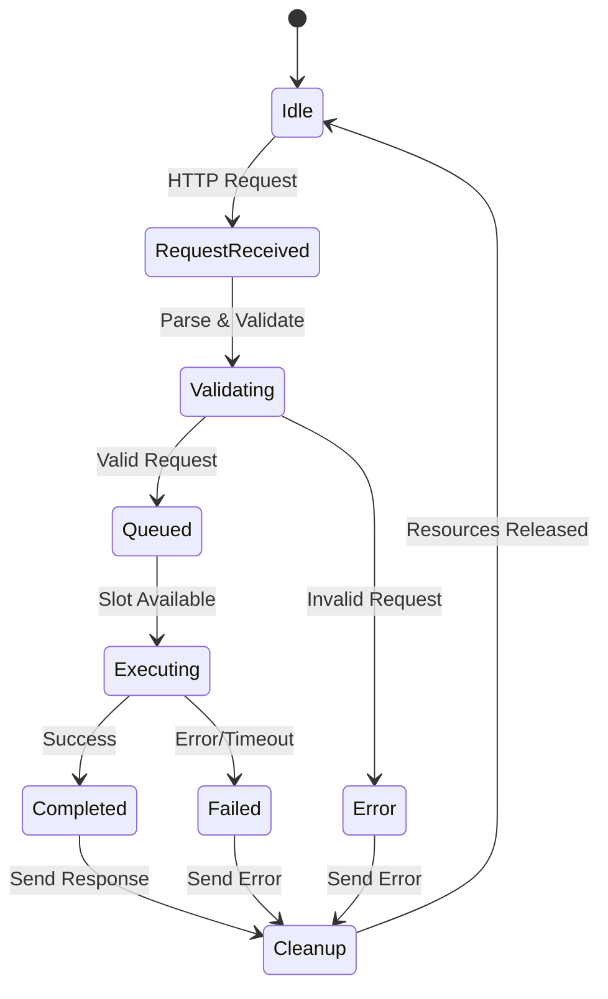
```mermaid
stateDiagram-v2
    [*] --> Idle
    Idle --> RequestReceived : HTTP Request
    RequestReceived --> Validating : Parse & Validate
    Validating --> Queued : Valid Request
    Validating --> Error : Invalid Request
    Queued --> Executing : Slot Available
    Executing --> Completed : Success
    Executing --> Failed : Error/Timeout
    Completed --> Cleanup : Send Response
    Failed --> Cleanup : Send Error
    Error --> Cleanup : Send Error
    Cleanup --> Idle : Resources Released
```

## Network Communication Patterns

### HTTP Connection Management

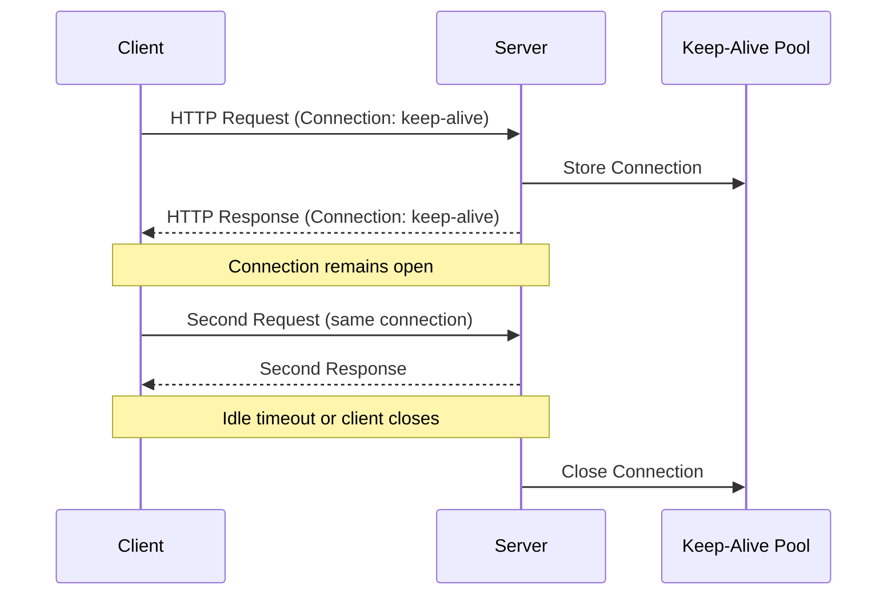
```mermaid
sequenceDiagram
    participant C as Client
    participant S as Server
    participant K as Keep-Alive Pool

    C->>S: HTTP Request (Connection: keep-alive)
    S->>K: Store Connection
    S-->>C: HTTP Response (Connection: keep-alive)
    
    Note over C,S: Connection remains open
    
    C->>S: Second Request (same connection)
    S-->>C: Second Response
    
    Note over C,S: Idle timeout or client closes
    
    S->>K: Close Connection
```

### WebSocket Integration (Future)

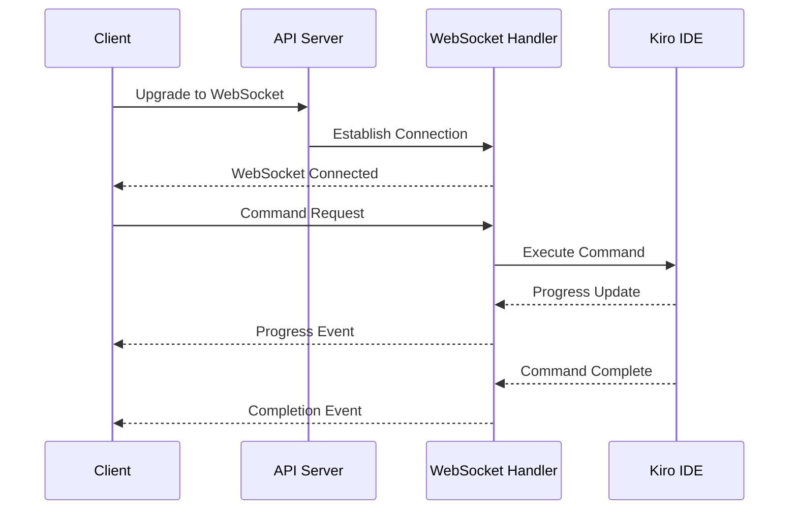
```mermaid
sequenceDiagram
    participant C as Client
    participant A as API Server
    participant W as WebSocket Handler
    participant K as Kiro IDE

    C->>A: Upgrade to WebSocket
    A->>W: Establish Connection
    W-->>C: WebSocket Connected
    
    C->>W: Command Request
    W->>K: Execute Command
    K-->>W: Progress Update
    W-->>C: Progress Event
    K-->>W: Command Complete
    W-->>C: Completion Event
```

## Error Propagation Flow

### Error Classification and Routing

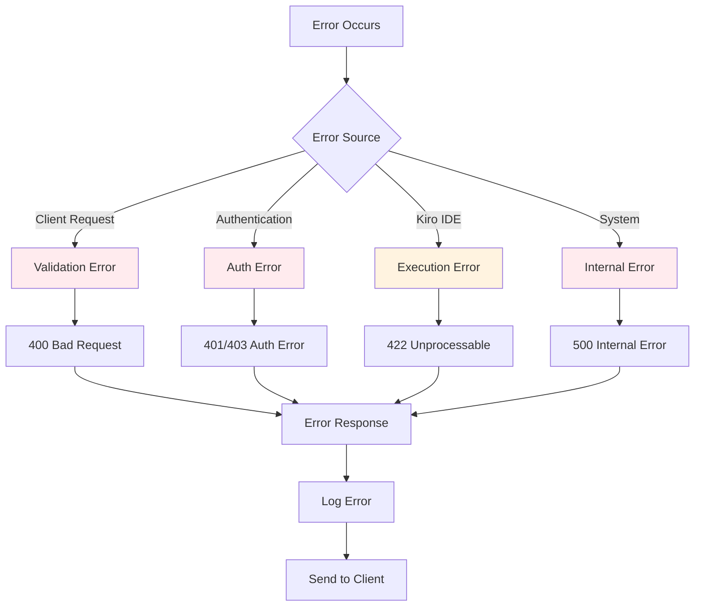
```mermaid
graph TD
    A[Error Occurs] --> B{Error Source}
    B -->|Client Request| C[Validation Error]
    B -->|Authentication| D[Auth Error]
    B -->|Kiro IDE| E[Execution Error]
    B -->|System| F[Internal Error]
    
    C --> G[400 Bad Request]
    D --> H[401/403 Auth Error]
    E --> I[422 Unprocessable]
    F --> J[500 Internal Error]
    
    G --> K[Error Response]
    H --> K
    I --> K
    J --> K
    
    K --> L[Log Error]
    L --> M[Send to Client]
    
    style C fill:#ffebee
    style D fill:#ffebee
    style E fill:#fff3e0
    style F fill:#ffebee
```

### Error Recovery Flow

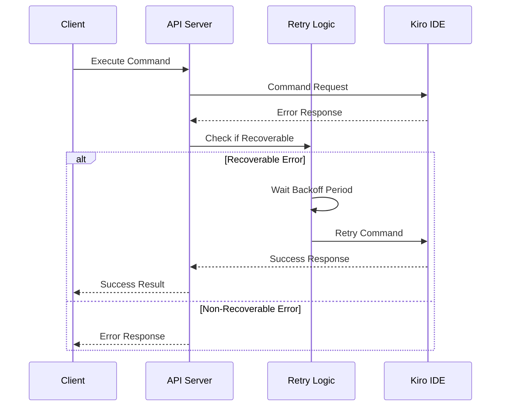
```mermaid
sequenceDiagram
    participant C as Client
    participant A as API Server
    participant R as Retry Logic
    participant K as Kiro IDE

    C->>A: Execute Command
    A->>K: Command Request
    K-->>A: Error Response
    A->>R: Check if Recoverable
    
    alt Recoverable Error
        R->>R: Wait Backoff Period
        R->>K: Retry Command
        K-->>A: Success Response
        A-->>C: Success Result
    else Non-Recoverable Error
        A-->>C: Error Response
    end
```

## Performance Optimization Data Flow

### Caching Strategy

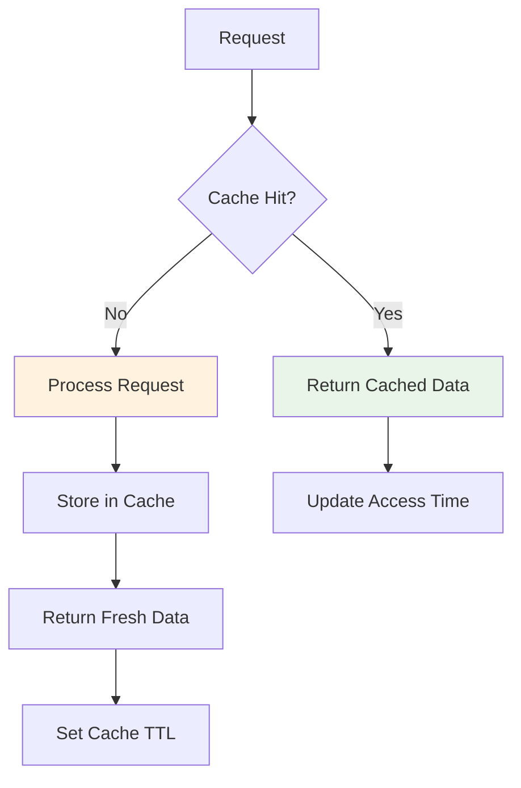
```mermaid
graph TD
    A[Request] --> B{Cache Hit?}
    B -->|Yes| C[Return Cached Data]
    B -->|No| D[Process Request]
    D --> E[Store in Cache]
    E --> F[Return Fresh Data]
    
    C --> G[Update Access Time]
    F --> H[Set Cache TTL]
    
    style C fill:#e8f5e8
    style D fill:#fff3e0
```

**Cached Data Types**:
- Available commands list
- Kiro status information
- Command execution results (selective)
- Configuration values

### Request Batching (Future Enhancement)

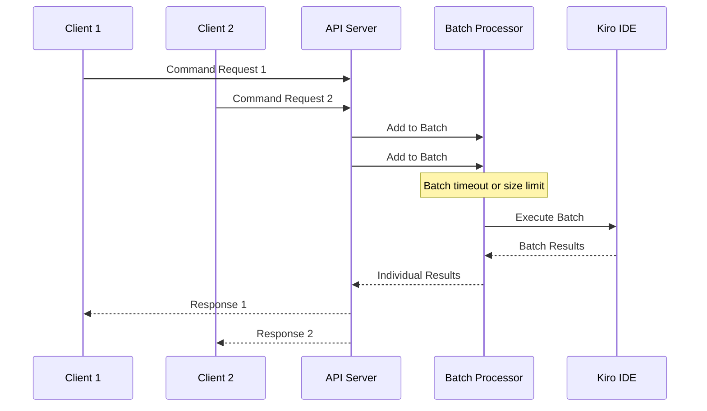
```mermaid
sequenceDiagram
    participant C1 as Client 1
    participant C2 as Client 2
    participant A as API Server
    participant B as Batch Processor
    participant K as Kiro IDE

    C1->>A: Command Request 1
    C2->>A: Command Request 2
    A->>B: Add to Batch
    A->>B: Add to Batch
    
    Note over B: Batch timeout or size limit
    
    B->>K: Execute Batch
    K-->>B: Batch Results
    B-->>A: Individual Results
    A-->>C1: Response 1
    A-->>C2: Response 2
```

## Monitoring and Observability Data Flow

### Metrics Collection Flow

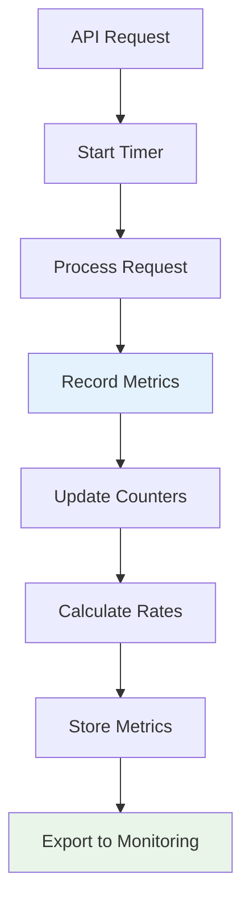
```mermaid
graph TD
    A[API Request] --> B[Start Timer]
    B --> C[Process Request]
    C --> D[Record Metrics]
    D --> E[Update Counters]
    E --> F[Calculate Rates]
    F --> G[Store Metrics]
    G --> H[Export to Monitoring]
    
    style D fill:#e3f2fd
    style H fill:#e8f5e8
```

**Collected Metrics**:
- Request count and rate
- Response time percentiles
- Error rates by type
- Concurrent request count
- Memory usage patterns
- Command execution statistics

### Log Data Flow

```mermaid
graph TD
    A[Log Event] --> B[Format Message]
    B --> C[Add Context]
    C --> D[Apply Filters]
    D --> E{Log Level Check}
    E -->|Pass| F[Write to Output]
    E -->|Block| G[Discard]
    F --> H[VS Code Output Panel]
    F --> I[Console Log]
    F --> J[File Log (Optional)]
    
    style F fill:#e8f5e8
    style G fill:#ffebee
```

## Next Steps

- **[Integration Patterns](/docs/overview/integration-patterns)** - Common integration approaches
- **[API Reference](/docs/api/overview)** - Complete API documentation
- **[Performance Guide](/docs/guides/polling-strategies)** - Optimize your integration
- **[Troubleshooting](/docs/guides/troubleshooting)** - Debug data flow issues

import { SeeAlso, PageNavigation } from '@site/src/components/NavigationHelpers';

<SeeAlso
  title="Related Topics"
  links={[
    {
      to: '/docs/overview/architecture',
      label: 'System Architecture',
      description: 'High-level system design and components',
      icon: '🏗️'
    },
    {
      to: '/docs/api/overview',
      label: 'API Reference',
      description: 'Complete API documentation',
      icon: '📚'
    },
    {
      to: '/docs/guides/error-handling',
      label: 'Error Handling',
      description: 'Handle errors in the data flow',
      icon: '🛠️'
    },
    {
      to: '/docs/guides/polling-strategies',
      label: 'Polling Strategies',
      description: 'Optimize data flow patterns',
      icon: '🔄'
    }
  ]}
/>

<PageNavigation
  previous={{
    to: '/docs/overview/architecture',
    label: 'System Architecture',
    description: 'Learn about the overall system design'
  }}
  next={{
    to: '/docs/overview/integration-patterns',
    label: 'Integration Patterns',
    description: 'Common integration approaches and patterns'
  }}
/>