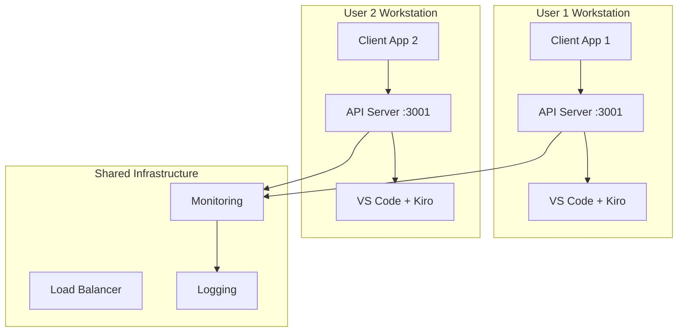

# Deployment Guide

This guide covers deploying and configuring the Kiro Communication Bridge in different environments, from development to production scenarios.

## Development Environment Setup

### Local Development

The simplest setup for development and testing.

#### Prerequisites

1. **VS Code** with Kiro IDE installed
2. **Node.js** 16+ (for client applications)
3. **Network access** to localhost

#### Installation Steps

1. **Install the Extension**
   ```bash
   # Install from VS Code Marketplace
   code --install-extension household-ai-engineer.kiro-communication-bridge
   
   # Or install from VSIX file
   code --install-extension kiro-communication-bridge-1.0.0.vsix
   ```

2. **Configure Basic Settings**
   ```json
   // .vscode/settings.json
   {
     "kiroOrchestration.api.port": 3001,
     "kiroOrchestration.api.enableCors": true,
     "kiroOrchestration.logging.enableDebugLogging": true
   }
   ```

3. **Start the API Server**
   - Open VS Code
   - Open Command Palette (Ctrl+Shift+P)
   - Run: "Kiro Communication: Start API Server"
   - Verify server is running at http://localhost:3001

4. **Test the Connection**
   ```bash
   # Test health endpoint
   curl http://localhost:3001/health
   
   # Test status endpoint
   curl http://localhost:3001/api/kiro/status
   ```

### Development with Docker

For consistent development environments across teams.

#### Dockerfile for Client Applications

```dockerfile
# Dockerfile for Flutter/Node.js client development
FROM node:18-alpine

WORKDIR /app

# Install dependencies
COPY package*.json ./
RUN npm ci

# Copy application code
COPY . .

# Expose port for development server
EXPOSE 3000

# Set environment variables
ENV KIRO_API_URL=http://host.docker.internal:3001
ENV NODE_ENV=development

CMD ["npm", "run", "dev"]
```

#### Docker Compose Setup

```yaml
# docker-compose.dev.yml
version: '3.8'

services:
  client-app:
    build: .
    ports:
      - "3000:3000"
    environment:
      - KIRO_API_URL=http://host.docker.internal:3001
      - NODE_ENV=development
    volumes:
      - .:/app
      - /app/node_modules
    depends_on:
      - kiro-bridge
    
  # Note: Kiro Bridge runs in VS Code on host
  # This is just for documentation
  kiro-bridge:
    image: placeholder
    external_links:
      - "host.docker.internal:3001"
```

#### Usage

```bash
# Start development environment
docker-compose -f docker-compose.dev.yml up

# Access application at http://localhost:3000
# Kiro Bridge API at http://localhost:3001 (on host)
```

## Production Environment Setup

### Single User Production

For individual developers or small teams.

#### System Requirements

- **OS**: Windows 10+, macOS 10.15+, or Linux (Ubuntu 18.04+)
- **Memory**: 4GB RAM minimum, 8GB recommended
- **CPU**: 2 cores minimum, 4 cores recommended
- **Storage**: 1GB free space
- **Network**: Localhost access required

#### Production Configuration

```json
// Production settings.json
{
  "kiroOrchestration.api.port": 3001,
  "kiroOrchestration.api.host": "127.0.0.1",
  "kiroOrchestration.api.apiKey": "prod-secure-api-key-32-chars-long",
  "kiroOrchestration.api.timeoutMs": 30000,
  "kiroOrchestration.api.enableCors": false,
  "kiroOrchestration.kiro.commandTimeoutMs": 300000,
  "kiroOrchestration.kiro.maxConcurrentCommands": 2,
  "kiroOrchestration.kiro.statusCheckIntervalMs": 10000,
  "kiroOrchestration.logging.enableDebugLogging": false
}
```

#### Security Hardening

1. **Generate Secure API Key**
   ```bash
   # Generate 32-character hex key
   openssl rand -hex 32
   ```

2. **Restrict Network Access**
   ```json
   {
     "kiroOrchestration.api.host": "127.0.0.1",
     "kiroOrchestration.api.enableCors": false
   }
   ```

3. **Configure Firewall**
   ```bash
   # Linux (ufw)
   sudo ufw deny 3001
   
   # Windows (PowerShell as Admin)
   New-NetFirewallRule -DisplayName "Block Kiro API" -Direction Inbound -Protocol TCP -LocalPort 3001 -Action Block
   
   # macOS
   # Use built-in firewall or third-party solution
   ```

#### Process Management

**Using PM2 (for Node.js client apps)**

```bash
# Install PM2
npm install -g pm2

# Create ecosystem file
cat > ecosystem.config.js << EOF
module.exports = {
  apps: [{
    name: 'kiro-client',
    script: 'dist/index.js',
    instances: 1,
    autorestart: true,
    watch: false,
    max_memory_restart: '1G',
    env: {
      NODE_ENV: 'production',
      KIRO_API_URL: 'http://localhost:3001',
      KIRO_API_KEY: 'your-production-api-key'
    }
  }]
};
EOF

# Start application
pm2 start ecosystem.config.js
pm2 save
pm2 startup
```

**Using systemd (Linux)**

```ini
# /etc/systemd/system/kiro-client.service
[Unit]
Description=Kiro Client Application
After=network.target

[Service]
Type=simple
User=kiro
WorkingDirectory=/opt/kiro-client
ExecStart=/usr/bin/node dist/index.js
Restart=always
RestartSec=10
Environment=NODE_ENV=production
Environment=KIRO_API_URL=http://localhost:3001
Environment=KIRO_API_KEY=your-production-api-key

[Install]
WantedBy=multi-user.target
```

```bash
# Enable and start service
sudo systemctl enable kiro-client
sudo systemctl start kiro-client
sudo systemctl status kiro-client
```

### Multi-User Environment

For teams or organizations with multiple developers.

#### Architecture Overview



#### User Isolation

Each user runs their own instance:

```json
// User-specific configuration
{
  "kiroOrchestration.api.port": 3001,  // Same port, different machines
  "kiroOrchestration.api.apiKey": "user-specific-api-key",
  "kiroOrchestration.workspace.isolation": true
}
```

#### Centralized Monitoring

**Monitoring Configuration**

```json
// monitoring-config.json
{
  "users": [
    {
      "id": "user1",
      "endpoint": "http://workstation1:3001",
      "apiKey": "user1-api-key"
    },
    {
      "id": "user2", 
      "endpoint": "http://workstation2:3001",
      "apiKey": "user2-api-key"
    }
  ],
  "checkInterval": 30000,
  "alerting": {
    "email": "admin@company.com",
    "slack": "#kiro-alerts"
  }
}
```

**Monitoring Script**

```typescript
// monitoring-service.ts
import { KiroApiClient } from './kiro-client';

interface UserConfig {
  id: string;
  endpoint: string;
  apiKey: string;
}

class KiroMonitoringService {
  private clients: Map<string, KiroApiClient> = new Map();

  constructor(private config: UserConfig[]) {
    this.config.forEach(user => {
      this.clients.set(user.id, new KiroApiClient(user.endpoint, user.apiKey));
    });
  }

  async checkAllUsers(): Promise<Map<string, boolean>> {
    const results = new Map<string, boolean>();
    
    for (const [userId, client] of this.clients) {
      try {
        await client.getStatus();
        results.set(userId, true);
      } catch (error) {
        results.set(userId, false);
        this.alertUserDown(userId, error);
      }
    }
    
    return results;
  }

  private alertUserDown(userId: string, error: any): void {
    console.error(`User ${userId} Kiro instance is down:`, error.message);
    // Send alerts via email, Slack, etc.
  }
}
```

## Cloud Deployment Considerations

### AWS Deployment

**EC2 Instance Setup**

```bash
#!/bin/bash
# user-data script for EC2 instance

# Update system
yum update -y

# Install Node.js
curl -fsSL https://rpm.nodesource.com/setup_18.x | bash -
yum install -y nodejs

# Install VS Code Server (code-server)
curl -fsSL https://code-server.dev/install.sh | sh
systemctl enable --now code-server@ec2-user

# Configure code-server
mkdir -p ~/.config/code-server
cat > ~/.config/code-server/config.yaml << EOF
bind-addr: 127.0.0.1:8080
auth: password
password: your-secure-password
cert: false
EOF

# Install Kiro extension
code-server --install-extension household-ai-engineer.kiro-communication-bridge

# Configure Kiro
mkdir -p ~/.local/share/code-server/User
cat > ~/.local/share/code-server/User/settings.json << EOF
{
  "kiroOrchestration.api.port": 3001,
  "kiroOrchestration.api.host": "127.0.0.1",
  "kiroOrchestration.api.apiKey": "${KIRO_API_KEY}",
  "kiroOrchestration.logging.enableDebugLogging": false
}
EOF

# Start services
systemctl restart code-server@ec2-user
```

**Security Group Configuration**

```json
{
  "SecurityGroupRules": [
    {
      "IpProtocol": "tcp",
      "FromPort": 22,
      "ToPort": 22,
      "CidrIp": "your-ip/32",
      "Description": "SSH access"
    },
    {
      "IpProtocol": "tcp", 
      "FromPort": 8080,
      "ToPort": 8080,
      "CidrIp": "your-ip/32",
      "Description": "VS Code Server"
    }
  ]
}
```

### Azure Deployment

**Container Instance**

```yaml
# azure-container-instance.yml
apiVersion: 2019-12-01
location: eastus
name: kiro-bridge-instance
properties:
  containers:
  - name: code-server
    properties:
      image: codercom/code-server:latest
      resources:
        requests:
          cpu: 2
          memoryInGb: 4
      ports:
      - port: 8080
        protocol: TCP
      environmentVariables:
      - name: PASSWORD
        secureValue: your-secure-password
      - name: KIRO_API_KEY
        secureValue: your-api-key
      volumeMounts:
      - name: config-volume
        mountPath: /home/coder/.config
  osType: Linux
  restartPolicy: Always
  ipAddress:
    type: Private
    ports:
    - protocol: TCP
      port: 8080
  volumes:
  - name: config-volume
    azureFile:
      shareName: kiro-config
      storageAccountName: your-storage-account
      storageAccountKey: your-storage-key
```

### Google Cloud Deployment

**Compute Engine Startup Script**

```bash
#!/bin/bash
# startup-script.sh

# Install Docker
curl -fsSL https://get.docker.com -o get-docker.sh
sh get-docker.sh
usermod -aG docker $USER

# Run code-server container
docker run -d \
  --name kiro-code-server \
  --restart unless-stopped \
  -p 127.0.0.1:8080:8080 \
  -v "$HOME/.local/share/code-server:/home/coder/.local/share/code-server" \
  -v "$HOME/projects:/home/coder/projects" \
  -e PASSWORD="your-secure-password" \
  -e KIRO_API_KEY="your-api-key" \
  codercom/code-server:latest

# Install Kiro extension
docker exec kiro-code-server code-server --install-extension household-ai-engineer.kiro-communication-bridge
```

## Monitoring and Logging

### Health Monitoring

**Health Check Script**

```bash
#!/bin/bash
# health-check.sh

KIRO_URL="http://localhost:3001"
API_KEY="your-api-key"

# Check health endpoint
if curl -f -H "Authorization: Bearer $API_KEY" "$KIRO_URL/health" > /dev/null 2>&1; then
    echo "$(date): Kiro Bridge is healthy"
    exit 0
else
    echo "$(date): Kiro Bridge is unhealthy"
    # Send alert
    curl -X POST https://hooks.slack.com/services/YOUR/SLACK/WEBHOOK \
         -H 'Content-type: application/json' \
         --data '{"text":"Kiro Bridge is down!"}'
    exit 1
fi
```

**Cron Job Setup**

```bash
# Add to crontab
*/5 * * * * /path/to/health-check.sh >> /var/log/kiro-health.log 2>&1
```

### Log Management

**Centralized Logging with rsyslog**

```bash
# /etc/rsyslog.d/50-kiro.conf
if $programname == 'kiro-bridge' then /var/log/kiro/bridge.log
& stop
```

**Log Rotation**

```bash
# /etc/logrotate.d/kiro
/var/log/kiro/*.log {
    daily
    missingok
    rotate 30
    compress
    delaycompress
    notifempty
    create 644 kiro kiro
    postrotate
        systemctl reload rsyslog
    endscript
}
```

### Metrics Collection

**Prometheus Integration**

```typescript
// metrics-exporter.ts
import { register, Counter, Histogram, Gauge } from 'prom-client';

export class KiroMetrics {
  private requestCounter = new Counter({
    name: 'kiro_requests_total',
    help: 'Total number of requests',
    labelNames: ['method', 'endpoint', 'status']
  });

  private responseTime = new Histogram({
    name: 'kiro_response_duration_seconds',
    help: 'Response time in seconds',
    labelNames: ['method', 'endpoint']
  });

  private activeConnections = new Gauge({
    name: 'kiro_active_connections',
    help: 'Number of active connections'
  });

  recordRequest(method: string, endpoint: string, status: number, duration: number): void {
    this.requestCounter.inc({ method, endpoint, status: status.toString() });
    this.responseTime.observe({ method, endpoint }, duration / 1000);
  }

  setActiveConnections(count: number): void {
    this.activeConnections.set(count);
  }

  getMetrics(): string {
    return register.metrics();
  }
}
```

## Backup and Recovery

### Configuration Backup

```bash
#!/bin/bash
# backup-config.sh

BACKUP_DIR="/backup/kiro/$(date +%Y%m%d)"
mkdir -p "$BACKUP_DIR"

# Backup VS Code settings
cp ~/.vscode/settings.json "$BACKUP_DIR/vscode-settings.json"
cp -r ~/.vscode/extensions "$BACKUP_DIR/extensions"

# Backup workspace settings
find ~/projects -name ".vscode" -type d -exec cp -r {} "$BACKUP_DIR/workspaces/" \;

# Create archive
tar -czf "$BACKUP_DIR.tar.gz" -C "$BACKUP_DIR" .
rm -rf "$BACKUP_DIR"

echo "Backup completed: $BACKUP_DIR.tar.gz"
```

### Disaster Recovery

**Recovery Procedure**

1. **Install VS Code and Extensions**
   ```bash
   # Install VS Code
   wget -qO- https://packages.microsoft.com/keys/microsoft.asc | gpg --dearmor > packages.microsoft.gpg
   sudo install -o root -g root -m 644 packages.microsoft.gpg /etc/apt/trusted.gpg.d/
   echo "deb [arch=amd64,arm64,armhf signed-by=/etc/apt/trusted.gpg.d/packages.microsoft.gpg] https://packages.microsoft.com/repos/code stable main" | sudo tee /etc/apt/sources.list.d/vscode.list
   sudo apt update
   sudo apt install code
   
   # Install Kiro extension
   code --install-extension household-ai-engineer.kiro-communication-bridge
   ```

2. **Restore Configuration**
   ```bash
   # Extract backup
   tar -xzf backup-20240119.tar.gz -C /tmp/restore
   
   # Restore settings
   cp /tmp/restore/vscode-settings.json ~/.vscode/settings.json
   cp -r /tmp/restore/extensions/* ~/.vscode/extensions/
   ```

3. **Verify Installation**
   ```bash
   # Start VS Code and verify extension is loaded
   code --list-extensions | grep kiro-communication-bridge
   
   # Test API endpoint
   curl http://localhost:3001/health
   ```

## Performance Tuning

### System Optimization

**Linux System Tuning**

```bash
# /etc/sysctl.d/99-kiro.conf
# Increase file descriptor limits
fs.file-max = 65536

# Network optimizations
net.core.somaxconn = 1024
net.core.netdev_max_backlog = 5000
net.ipv4.tcp_max_syn_backlog = 1024
```

**VS Code Performance**

```json
{
  "extensions.autoUpdate": false,
  "extensions.autoCheckUpdates": false,
  "telemetry.enableTelemetry": false,
  "workbench.enableExperiments": false,
  "files.watcherExclude": {
    "**/node_modules/**": true,
    "**/.git/**": true,
    "**/dist/**": true
  }
}
```

### Resource Monitoring

**System Resource Script**

```bash
#!/bin/bash
# monitor-resources.sh

while true; do
    echo "$(date): CPU: $(top -bn1 | grep "Cpu(s)" | awk '{print $2}' | cut -d'%' -f1)%"
    echo "$(date): Memory: $(free | grep Mem | awk '{printf "%.1f%%", $3/$2 * 100.0}')"
    echo "$(date): Disk: $(df -h / | awk 'NR==2{printf "%s", $5}')"
    echo "---"
    sleep 60
done >> /var/log/kiro-resources.log
```

## Troubleshooting Deployment Issues

### Common Problems

1. **Port Already in Use**
   ```bash
   # Find process using port
   lsof -i :3001
   
   # Kill process
   kill -9 <PID>
   
   # Or change port in configuration
   ```

2. **Permission Denied**
   ```bash
   # Fix file permissions
   chmod +x /path/to/kiro-scripts/*
   chown -R kiro:kiro /opt/kiro-client
   ```

3. **Extension Not Loading**
   ```bash
   # Check extension installation
   code --list-extensions
   
   # Reinstall extension
   code --uninstall-extension household-ai-engineer.kiro-communication-bridge
   code --install-extension household-ai-engineer.kiro-communication-bridge
   ```

4. **API Not Responding**
   ```bash
   # Check VS Code process
   ps aux | grep code
   
   # Check extension logs
   # Open VS Code -> View -> Output -> Select "Kiro Communication Bridge"
   ```

### Debug Mode

Enable debug logging for troubleshooting:

```json
{
  "kiroOrchestration.logging.enableDebugLogging": true,
  "kiroOrchestration.logging.logLevel": "debug"
}
```

## Next Steps

- **[Configuration Reference](/docs/reference/configuration)** - Detailed configuration options
- **[Troubleshooting Guide](/docs/guides/troubleshooting)** - Common issues and solutions
- **[Performance Optimization](/docs/guides/polling-strategies)** - Optimize your deployment
- **[Security Best Practices](/docs/guides/error-handling)** - Secure your deployment

import { SeeAlso, PageNavigation } from '@site/src/components/NavigationHelpers';

<SeeAlso
  title="Deployment Resources"
  links={[
    {
      to: '/docs/reference/configuration',
      label: 'Configuration Reference',
      description: 'Complete configuration options and settings',
      icon: '⚙️'
    },
    {
      to: '/docs/guides/troubleshooting',
      label: 'Troubleshooting',
      description: 'Common deployment issues and solutions',
      icon: '🐛'
    },
    {
      to: '/docs/guides/quick-start',
      label: 'Quick Start',
      description: 'Get started with basic setup',
      icon: '🚀'
    },
    {
      to: '/docs/overview/architecture',
      label: 'System Architecture',
      description: 'Understand the system design',
      icon: '🏗️'
    }
  ]}
/>

<PageNavigation
  previous={{
    to: '/docs/reference/configuration',
    label: 'Configuration Reference',
    description: 'Learn about all configuration options'
  }}
  next={{
    to: '/docs/guides/troubleshooting',
    label: 'Troubleshooting',
    description: 'Solve common deployment issues'
  }}
/>